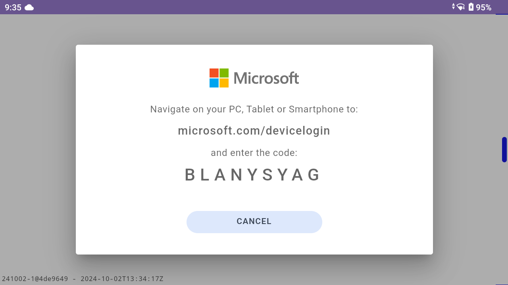

import YouTube from '@site/src/components/YouTube.js'

When developing an app, asking your users to sign-in is often a straightforward process on traditional devices like smartphones or tablets.
We can usually type passwords, use fingerprint scans or follow a Single Sign On process.
But, on hands-free devices without a keyboard or a mouse, things get a bit more complicated.
These devices are designed for minimal user interaction, making traditional authentication methods less practical and sometimes impossible.

RealWear, with its WearHF voice input system, provides a great primary interaction method.
While voice input works well in most scenarios, logging in can require a different approach.

We aim to make the user experience as seamless and easy as possible, but the login process can often feel cumbersome.
To inspire better solutions, here are three different ways to sign users in on a hands-free device, along with their pros and cons.

For these samples we're going to make full use of the OpenID Connect flows that are supported by Microsoft Entra ID.
However, these techniques will work just fine with other similar authentication providers such as Okta or Google.

For more information see [OpenID Connect (OIDC) on the Microsoft Identity Platform](https://learn.microsoft.com/en-us/entra/identity-platform/v2-protocols-oidc)

## 1. Device Code Authentication

Device code authentication involves using a secondary device to complete the sign-in process.
This method is similar to Azure Entra Device Code Flow, where a user receives a code on their hands-free device and enters it on a secondary device, such as a smartphone or computer, to authenticate.
This provides a secure and convenient way to sign in without needing to speak a password aloud.

The main advantage of this approach is that it leverages the capabilities of a secondary device, which can handle more complex authentication, including biometrics or multi-factor authentication.
This method is effective in environments where using voice commands might be impractical or where users have easy access to another device.

**Pros:**
- Users do not need to speak credentials
- They may already be logged in on their other device, no need to enter any credentials
- Fully supported by common OpenID Connect login providers (ie: Microsoft)

**Cons:**
- Requires a secondary device in order to login
- Can be slightly cumbersome for shared devices (although better than speaking credentials)
- Some organizations may block device code login

### Demo

A quick 30-second demo showing how easy it is for the end-user to login to your Microsoft account using a PC.

<YouTube id="SRGpMcv7A2o"></YouTube>

### User Experience Benefits

Device code authentication makes the sign-in process comfortable for users, especially in environments where typing is cumbersome and speaking passwords aloud is impractical.

You can prompt the user in a clear and concise manner what steps they need to perform. The minimum you need to display is the URL to navigate to and the code to type in.

For Microsoft, the URL is `microsoft.com/devicelogin` and the code is usually **9 digits long**.
Be sure to present the URL and code in a large font (use letter spacing between the digits) for easy readability.

As you can see in the screenshot above from RealWear, we highlight clearly the URL and the code with a simple option to "Cancel".

### implementation

For an example on how to implement please check out the source code to our RealWear Collaborate app. [Available on GitHub](https://github.com/realwear/collaborate).

## 2. QR Code

In situations where a user might not be able to sign in with an external device, another effective hands-free sign-in method is using a pre-generated QR code.
As with the Device Code login, there is no need to speak sensitive credentials and the process of signing-in is seamless.

When requested, the user simply present the QR Code to the RealWear camera (QR codes can easily be read at arms length) and the process is complete.

Additionally, one key advantage of QR code login is that the authentication step can be completed in advance.
So, if the user operates in a "shared device" environment it is trivial to implement a user swap.

However, unlike Device Code login, this flow is not part of the OpenID Connect standard so the implementation may be custom.
But fortunately, there are different ways of implementing this.

**Pros:**
- User can print QR Code or store on smartphone for quick login
- Very easy to initiate a sign-in flow
- QR code can be generated in advance

**Cons:**
- Not generally supported by OpenID Connect, workarounds are required
- Need to store user secrets on a server (not a password, but still sensitive)
- If printed, codes can be lost

### How does it work?

For QR code to login, 2 separate processes need to happen. 1. **Generate QR code on a PC, Smartphone, etc...** and 2. **Scan the QR code on your headset**.

:::info
As QR-Code sign in systems are usually proprietary, be careful to follow all of the best security processes. 
It's never normally a good idea to write a sign-in mechanism from scratch.

Also, don't store passwords inside QR Codes, implement some form of unique code unrelated to their password.
:::

#### Generating the QR Code

1. On a separate device, open the QR code generator app
2. Login to the identity service (ie: Microsoft)
3. Remote server will store the access and refresh tokens for use on the device
4. Print / Save the QR code
    - QR Code will contain some lookup key to retrieve the access and refresh tokens

#### Scanning the QR Code

1. Start the "Sign in Scan" flow on the headset
2. Connect to the server and retrieve the refresh tokens using the QR code
3. Access the protected API's

## 3. Username and Password

:::danger Beyond here there be dragons

While we don't recommend this, we're adding this section in for completeness.

:::

The traditional method of signing in—username and password—is one of the worst fits for hands-free devices.
Imagine trying to dictate a complex password out loud, especially when it includes symbols, numbers, and mixed-case letters.
Not only is this frustrating for the user, it also raises security concerns since passwords spoken aloud can easily be overheard.

That said, usernames and passwords still have their place, especially in environments where security is paramount and other solutions are impractical.
But it's clear that for hands-free devices, this method is far from ideal. Most users would agree: speaking out "Uppercase Q, dollar sign, 4, lowercase z" isn't exactly seamless.

**Pros:**
- No other device / code required
- Fully supported by common OpenID Connect login providers (ie: Microsoft)

** Cons:**
- Speaking a username or password is really bad practice
    - It's very slow
    - And insecure!
- If a 2FA code is required, more information is required

## Wrapping Up

Authentication for hands-free devices like RealWear presents unique challenges, but with the right approaches, these hurdles can be overcome. By leveraging methods such as Device Code Authentication or QR Code sign-ins, we can deliver a seamless, secure user experience tailored to these devices' unique constraints.

While traditional username-and-password methods are technically an option, they highlight why innovative solutions are essential in this space. Hands-free devices demand a rethinking of conventional authentication strategies to ensure security, usability, and practicality.

As developers, our goal should always be to simplify the experience for users without compromising on security. By adopting modern techniques and keeping the user in mind, we can ensure these devices are as accessible and effective as possible.

Authentication doesn’t have to be a pain point—it can be an opportunity to innovate and delight users. What’s your go-to authentication strategy for hands-free devices? Let us know in the comments!
