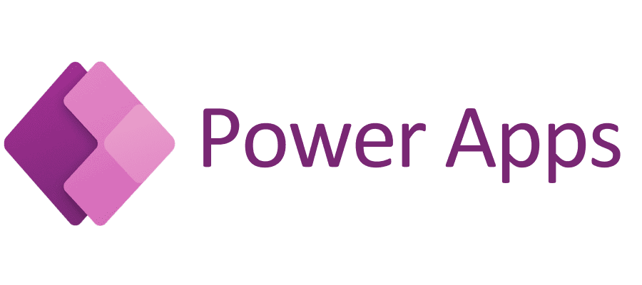
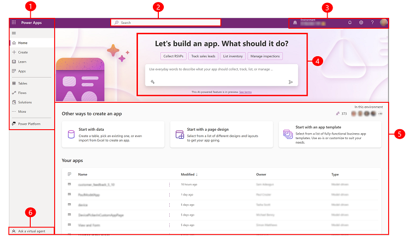

# Microsoft Power Apps
## Getting Started With Microsoft Power Apps

You might already be familiar with Power Apps if you're visiting this page, but here's a quick overview:

Microsoft Power Apps is a low-code development platform that enables users to create custom business applications without needing extensive coding knowledge. It offers a visual interface and pre-built templates to design apps for both web and mobile devices.

Power Apps is part of the larger Microsoft Power Platform, which also includes Power Automate (formerly known as Microsoft Flow), Power BI, and Power Virtual Agents.

With Power Apps, users can create custom apps for various business needs, such as tracking inventory, managing customer data, or automating workflows.

Power Apps allows users to connect to various data sources, such as SharePoint, Excel, and SQL databases, and to build interactive forms, workflows, and dashboards. These can be compiled into native Android apps, providing an APK for you to deploy. However, there are some steps that need to be followed to ensure a good experience with RealWear headsets. Below, we outline some of the challenges of creating Power Apps for RealWear headsets and how to overcome them.

### Prerequisites

1. Microsoft Account
2. Access to the Power Apps platform (you may need an Azure Administrator to enable this)
3. An idea for an app
4. A basic understanding of running apps on RealWear headsets
5. Power Apps installed from RealWear Marketplace

### Introduction
The Power Apps home page offers various options for creating your own apps, opening apps that you or others have created, and performing related tasks.

Our documentation focuses on developing apps specifically for RealWear headsets, with this in mind, our apps are all designed for landscape orientation.

### Creating Your First App
There are multiple ways to start your first Power App. You can begin with a data source, a page design, or a template. 
The choice is yours depending on your needs, but remember, the adjustments needed for your app to display successfully on a RealWear headset can be made later. We recommend avoiding the template option, as these may not be the best optimized for the headset.

### Power Apps Studio
Power Apps Studio is the primary interface you will use to design, create, and manage your app according to your specific business needs. Power Apps Studio is specifically designed for creating and managing canvas apps.

|  |
| :------------------------------------------------------------: |

### Power Apps Headset App
We've collaborated directly with Microsoft to optimize a version of the Power Apps Mobile app specifically for our headsets, available from our RealWear App Marketplace. You may be able to get the Power Apps wrapper directly from Microsoft, but you might experience issues with Voice Controls and WearML. We recommend using our version.

### AI in Power Apps
In our business card reader, we've demonstrated a small app using Microsoft AI to extract data from a scanned business card. Access to Microsoft's AI features requires a paid add-on available from Microsoft. Once you have this, you can incorporate AI capabilities into your Power App.
