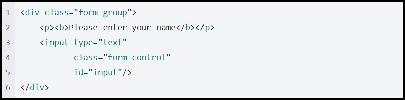
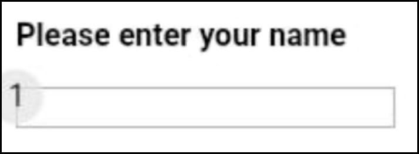
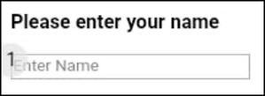
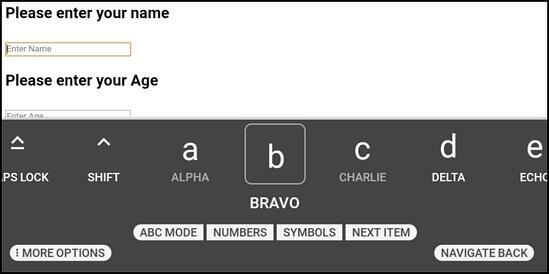
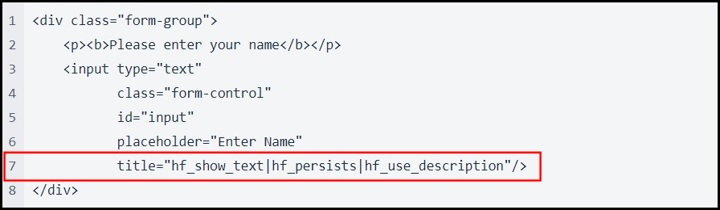
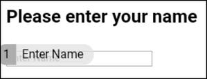
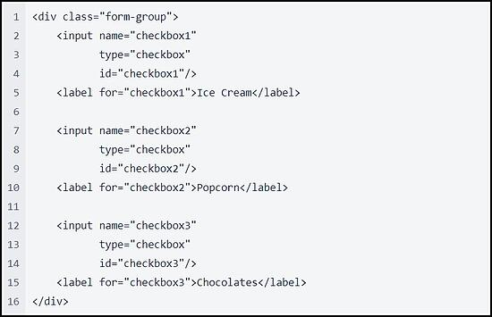
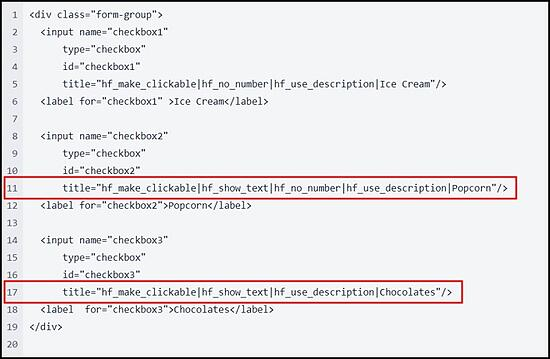

# HTML

## Overview

__Note:__ *The original HTML API was no longer functional and used WearML scripts to process tags and information within an HTML page. This HTML implementation is intended to emulate the native Android WearML support.*

*For documentation on WearHF Directives, [click here](../../wear-ml/embedded-api.md).*

HTML web developers can use the HTML attributes __placeholder__ and __title__ for input HTML tags to create voice commands and inject RealWear directives, such as numbers or words over buttons, overlays, etc. This allows web applications to be fully utilized by your RealWear device.

In native Android, we have the content description attributes within UI elements to use for speech commands. In HTML, we have the __placeholder__ and __title__ attributes that are combined at runtime to give us the web version of content description. Native Android and HTML can be used together, wherever necessary.

### Approach

Two obstacles were identified in the process:

- Injecting JavaScript into a WebView to retrieve information used too much of the device resources.
- Creating a design pattern for HTML developers would increase the barrier to entry.

The goal was to utilize existing design patterns in both HTML and native Android to improve our customers experience when developing HTML applications for RealWear devices.

## Text Input Field Example

Typical website design patterns would have __placeholder__ text in the text input fields. For RealWear device web applications, visual elements are cues for voice commands. If the HTML developer builds an app on a RealWear device, it is now intuitive to make the __placeholder__ text become a voice command.

The following images illustrate an HTML snippet to create a text input field, followed by the created text input field.

If a clickable item has the HTML __placeholder__ attribute, your RealWear device will convert the __placeholder__ text into a voice command if *hf_use_description* is used.

Note: Using __placeholder__ text is optional.

If the HTML developer changes the code to include a descriptive voice command with the *hf_use_description*, add __placeholder__ text as the visual element. The __placeholder__ text is shown on line 6 and the directive is shown on line 7 in the following image.

When a user says, “ENTER NAME” or “SELECT ITEM 1”, the RealWear device selects the text input field and opens the voice keyboard.

If the HTML developer includes a directive like *hf_show_text* to show voice commands over the clickable item, or *hf_persist* to keep voice commands visible, the developer would include the directive they want in the HTML __title__ attribute and separate each directive with the pipe (“|”). The directives are shown on line 7 in the following image.

__Note:__ *If you do not want to display a number bubble, add hf_no_number separated by a “|” (pipe) to line 7. Additionally, remove hf_show_text from line 7 to remove the display text. This allows the placeholder text to display the voice command only.*

## Checkbox Example

Not all clickable elements have placeholder text. An HTML developer can add a voice command to a clickable element, like a checkbox, without a placeholder.

The HTML developer can add the voice command into the __title__ attribute. If additional directives are required, the HTML developer can add each directive separated by a pipe (“|”). The directives are shown on lines 11 and 17 in the following image.

The checkbox element is focused when the command is given but not clicked. HTML developers can add the *hf_make_clickable* directive to correct this behavior. This directive, combined with other directives shown in the following image, gives HTML developers more control over the UI appearance. Each checkbox uses slightly different directives from the API to give a specific output.

In the image below, the three checkboxes are described as follows:

- Checkbox one is a clean, straightforward “say what you see” design.
- Checkbox two displays the voice command hint without the number command displayed.
- Checkbox three displays the “say what you see” voice command, the hint text, and the default number selection bubble.

## Other Important Information

All HTML elements can be given commands, but some tags lose the assigned voice command after a single use. This usually happens when the element is not an intractable UI element, like div tags.

If this happens with an element you are working with, add a __tabindex__ attribute to the tag next to the __title__ attribute. This forces the RealWear speech service to respect the voice command assigned, as seen with buttons and other clickable elements.

__Note: tabindex = “-1”__ *is recommended for minimal impact.*

A __tabindex__ attribute is also useful if you want to add hf_no_number on the root element to remove all number indexes from the page.

This can be done with the following example:

__`<body tabindex="-1" title="hf_no_number">`__

If you want to add a simple selection to any tag without voice commands, add an empty __onclick=””__ attribute and the element will get a number index for selection.

*__Note:__ If you already have an __onclick__ attribute and want to remove the number selection bubble, use the hf_no_number directive.*

## Known Limitations

For known HTML limitations, see the following:

- Command tooltips show for offscreen elements. This is a feature of WebView 74. To remove this feature, load a newer version of WebView onto your RealWear device.
- Web browsers behave differently and cause different elements to be picked up by the RealWear speech engine. Testing on multiple browsers will confirm consistent behavior.
- Some hybrid tags, like hyperlink, require the *hf_no_number* directive to be used to remove the selection number bubble.
- The *hf_text_dictation* directive is unavailable. Text dictation mode launches a keyboard for talk-to-text mode. Users can say “MORE OPTIONS”, and then say “DICTATION” to open dictation mode from within the keyboard.
- The *hf_persists* directive allows number selection bubbles and displayed voice commands to remain on the screen. To use *hf_persists*, do one of the following:
  - Add the *hf_persists* directive to each displayed HTML element on the page.
  - Add the *hf_persists* directive to the first and last displayed HTML elements on the page.
- Once a radio button has been selected, it cannot be unselected. HTML developers must add a manual reset for radio button elements, such as a clickable button to clear the selected items programmatically.

## HTML Example

For an HTML example in GitHub, click here: [RealWear HTML Example App](https://github.com/realwear/HTML-ExampleApp).
