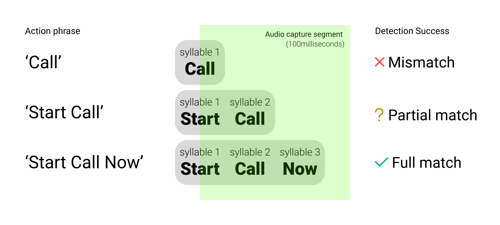
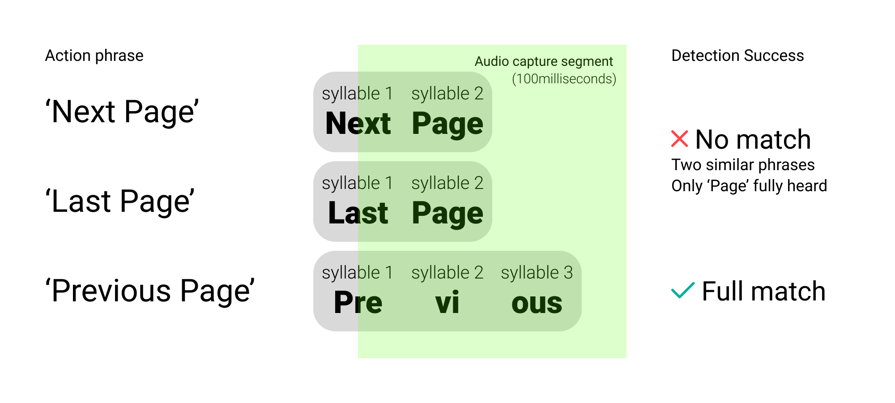
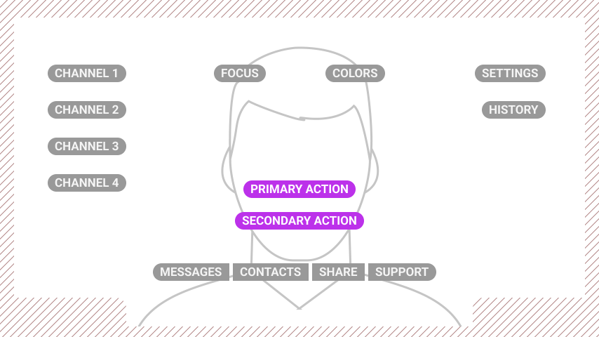
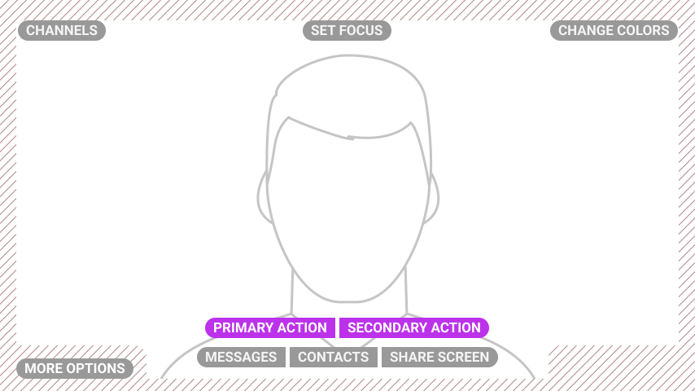
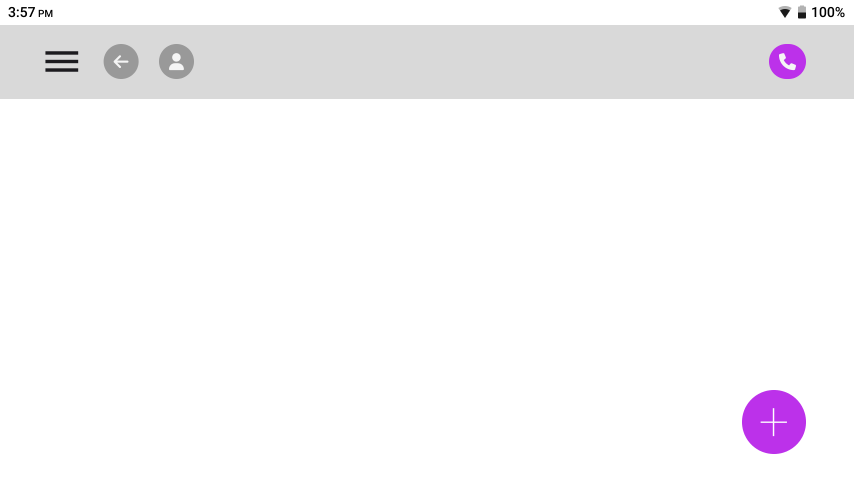
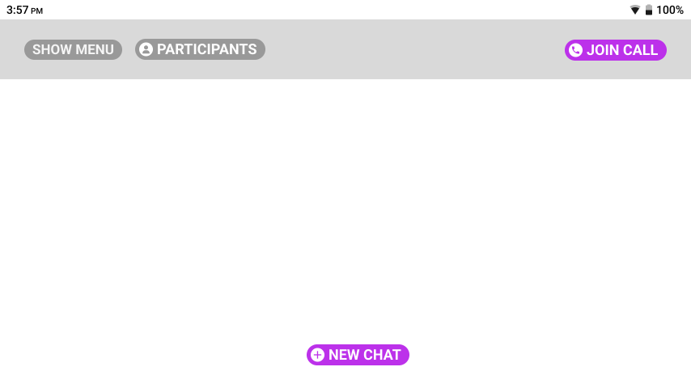
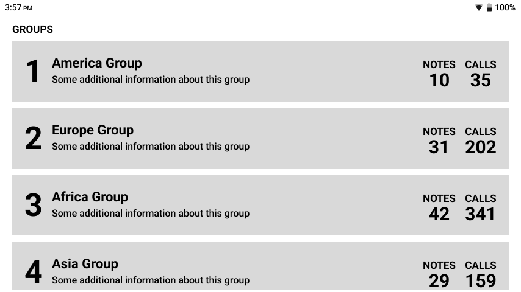
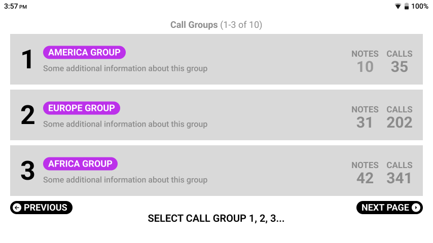

# User Experience Guidelines

Our devices are designed to be used completely handsfree and with that in mind, we have some strong recommendations to follow when designing your User Experience to ensure that your users get the most out of using our device. We can separate these out in to three main categories; Oral (how you speak and interact with the device via your voice), Visual (How your app is laid out and how it looks) and General (General best practices).

## General
These guidelines dictate some general principles for how to prepare your app for working on our devices.

### Adapting to Handsfree
Our devices run on Android, so it may be tempting to think that an existing app and it's UX is already perfectly suited to work on our devices. However, the main Android use case is for touch screen devices and our device does not have a touch screen. Whilst it will 'work' without any adaptation or optimisation, it wont necessarily provide the best or most fluid experience.

#### We recommend:

- Consider the primary hands-free use-cases of your app and focussing your UX on them.
- Some features may make less sense in the context of our headset, for example, the entry of lots of text, or the navigation of detailed settings that may detract from the ease-of-use of the app. Removing or obfuscating these features would promote the usability of the main use cases.
- Removing or deprecating navigation / features that hands-free users are unlikely to use which may clutter the interface.

### Translate with care
Although we support a wide and growing array of different [languages](../hardware/languages.md) on our devices, it is very important to note any changes that may happen (both with how elements are presented on screen and the voice commands) when using your app in different languages.

#### We recommend:

- Thorough QA and testing of any translations to highlight any potential issues with voice commands
- Review any layouts once translated to make sure that button lengths etc. are still acceptable in all supported languages.

### Using WearML Optimisation
RealWear's WearHF software allows user to navigate interfaces which haven't been designed for our device, by adding WearHF overlays over interactable elements. However, reliance on this for core interactions creates a poor user experience and can lead to a cluttered UI. You can fine tune how the WearHF overlays are displayed using RealWear's markup language, WearML, which you can find out more about [here.](../wear-ml/embedded-api.md)

#### We recommend:

- Only using WearML bubbles for instances where orally distinction actions are not possible.
- Utilising the buttons and groups contained in the RealWear UI kit as these will allow users who are familiar with the device to quickly understand your app.
- Making use of the More Options and Show Help menus to congregate menu elements.

## Oral
These Guidelines dictate how you should interact with the device when using voice commands and how you should structure those voice commands.

### Use Multiple Syllables
Wherever possible, you should try to use 2 or more syllables for your voice commands. This is to allow WearHF to capture your command sufficiently to match it to your intended action without having to use multiple attempts which may frustrate your users.

|  |
| :--: |
| * This shows how the system will be able to match multi-syllabic commands better than mono-syllabic ones * |

### Orally Distinct Commands
When you have multiple commands on a screen, you should be aware to make sure that when you look at the second and/or third syllable for each command that they are orally distinct. When you have commands where the second and/or third syllables are identical, the system can have issues separating between the different commands which can provide a frustrating experience for users.

|  |
| :--: |
| * As you can see, Next and Last Page commands are too similar as the system can only fully differentiate the final syllable which is idenitical * |

## Visual
These Guidelines show how you should lay out your UI to work best for our device and some visual best practices to help make the best looking app for your users.

### Keep text legible and concise
When designing for our headsets, concise and use-case focussed design is key for a successful experience. Too much superfluous text, or text that is difficult to read can make an app frustrating to use.

#### We recommend:
- Using text no smaller than 16sp and ideally greater than 20sp.
- Avoid the use of large amounts of copy wherever possible as this will keep screens legibility and interactions clear.
- Make button text all-caps / uppercase. This will help user's easily identify voice commands.

### Avoid Too many Actions on Screen at once
Complex interfaces make it harder for users to get started, causing them to take more time to make decisions and sometimes getting confused. Instead of trying to show all the actions at once, it's better to think about which actions are most important for users. You could also put less important actions together in the 'More Options' section of WearML.

| Bad Example | Good Example |
| :-----------: | :-----------: |
|  |  |
| * There are far too many buttons on this screen and they create a jumbled interface, obstructing the main focus * | * To decrease clutter and improve decision-making we've reduced the elements on screen by using groups and overlays * |

### Respecting Safe Areas
Whenever possible avoid the placement of key visual or navigational elements within the safe-area of the screen. This is 25dp from the Top, 20dp from the Left and Right sides and 15dp from the bottom for a 854 x 480dp canvas.

| Bad Example | Good Example |
| :-----------: | :-----------: |
|  |  |
| * The CTAs here are pushed right to the corners of the screen which can lead to them overlapping with key visual elements and also make them hard to read depending on viewfinder position * | *  CTA buttons are moved inward into the safe area, so they will no longer overlay other elements. The text area is reduced and the font size increased to increase ease of legibility. The primary flow CTA is given more prominence to improve UX. * |

### Use Text instead of Icons/Graphics
When designing your interface, be very wary whenever using iconography. Whilst clear iconography can aid the quick location of an action, it provides little insight into how to say that action. To avoid confusion consider removing iconography or pairing with a visible input text.

| Bad Example | Good Example |
| :-----------: | :-----------: |
|  |  |
| * Interfaces which start life as a web / touchscreen may well rely on Iconography to indicate what an action does. The screen above would require the user to guess the voice command required which is a very poor user-experience. * | *  Now the interface has been converted to work on our headset. All voice commands are visible and the iconography offers additional visual signposting. Also note, the back button has also been removed as users can always use the global voice command 'Navigate Back'. * |

### Make Interactions Clear
Our Devices work on a **Say What You See** method of navigation. Therefore it is important for users to easily distinguish between speakable interactive elements and passive information.

| Bad Example | Good Example |
| :-----------: | :-----------: |
|  |  |
| * There is no visual distinction as to what is a command here and what is passive information. The user has to guess what would be the voice command to select an element in this table. It is also unclear whether this is a continuous list or not * | *  Voice Commands are now far clearer. Pill buttons and uppercase highlight the commands. Pagination is optional as scrolling commands (Page Up/Down) exist but pagination provide clear navigation and expectation to users * |

### Choose your Colour pallette wisely
Whilst the displays on our devices offer full colour support, the choice of colours in your palette is key to user accessibility and easy navigation of your app.

#### We recommend:
- Keeping colour palettes simple, use highly-saturated colours sparingly.
- Avoid simultaneously contrasting colour elements next to each other.
- Avoid large gradient fills, especially behind text.
- For text try to use dark text on a light background where possible.
- Test in both light and dark modes

:::note

The colour profile of our older devices means that the displays can suffer from low colour distinction, for example between blue and green, so testing your colours on the device to ensure accurate reproduction is crucial.

:::