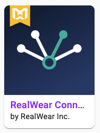
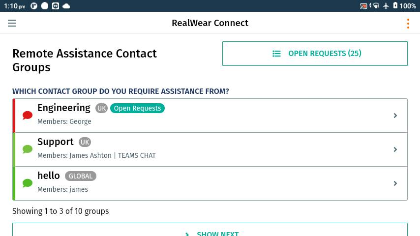

# Certified By RealWear

## What is Certified by RealWear?
The Certified by RealWear initiative is a way to highlight applications that work particularly well on our devices and provide both real value to users and also give those users a great hands-free experience whilst using them. These apps will appear in the RealWear Marketplace with a badge on their listing icon and also get further options for promotion above uncertified apps by being featured in the editor's pick section etc.

### Certification Requirements

#### Authentication without voice
Authentication stands as a pivotal component within any application workflow, serving as the initial challenge when employing hands-free computing. This is because the majority of systems necessitate, at a minimum, a username and password for user authentication in order to access services. With hands-free computing, it is imperative to avoid scenarios in which users are required to vocalize their confidential credentials. We are unable to certify applications that adopt such an approach.

Better ways would be to use oAuth's Device code login (see RealWear CloudSync) system or to have a QR code that the user scans having their credentials embedded.

#### Clean and clear User Interface
The key to a good experience on our devices is the Visual Interface. Although we provide helpers like the WearHF overlays, you should not rely on them and have too many appearing on the screen at once as that could create visual clutter that can distract a user. The best way to make sure that your users have the optimum experience is to make it clear in your app what each part of the UI does and what the user would have to say to select them. There are many ways in which you can do this, please see our [User Experience Guidelines](../Basics/ux-guidelines.md) for more in depth guidance.

|  |
| :--: |
| * As this screenshot from RealWear Connect demonstrates, it is possible to design a UI without any WearHF overlays at all * |
#### Use RealWear's voice engine

- We can only guarantee that an app will work correctly on our devices if it is using our voice recognition and processing engine. When using third-party voice engines, we can't guarantee that commands will work effectively or that things will be understood by the system.

#### Dictation (use the dictation service for natural language input instead of using virutal keyboard input)
When inputting text, the easiest way to do it on most modern devices is with a keyboard, but when you need your hands to be free and available to do other things, that becomes impossible. Our devices and WearHF ship with a variety of options for inputting text, but the best way is to use our dictation service to be able to use natural language input. This way users will not have to spell out words one letter at a time.

### Extra Enhancements
These extra elements will help your app to stand out further when assessing them and will help to showcase what is the gold standard for development on RealWear devices.

#### UI Scaling
As our devices currently come in different screen resolutions, having an app that scales well on our whole range, whilst maintaing a great experience is very important. It isn't a strict requirement of ours, but will help to show effort has been taken to ensure wide compatibility across devices.

#### Separating primary and secondary actions in the UI
As a user, you don't want to be bombarded visually with all the possible actions that you could possibly do on a screen. Having only the main primary actions shown as a priority on the screen and then having any secondary or lesser used options in a separate screen or in an overflow menu helps to maintain a tidy UX, whilst also keeping users productive and not stopping them from completing their tasks.

#### Target Android API 29 (Android 10)
Our devices ship with Android 10 (HMT-1/1Z1) or Android 11 (Navigator 5xx series), targetting the Android API closest to our devices allows you to ensure optimal run conditions for our hardware and also gives you access to more and more APIs and features.

## Getting Certified
Have you read through all of this and are interested in getting your app certified? Simply fill out [this form]( https://share.hsforms.com/1gmjyjrNnQjSS7DBg9KEJ5g2mvce) and our team will be in touch to discuss any changes or suggestions they may have to make sure your app gets the badge!
