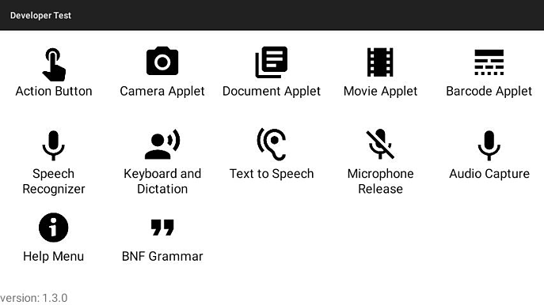

# Examples Overview

## Download and Installation

The Developer Examples app is available to download as an APK which can be installed onto the RealWear Device.

[Download Zip](https://realwear.box.com/shared/static/wk1i8w1ljfg0qt11vhdptesuo0asz6t1.zip)

Install the Developer Examples app on the device.

The app contains a number of examples which can be viewed by following the instructions on the screen. Information about each example can be found below with a link to its source code.

## Examples

The following examples are available within the app. Each example has source code and documentation available.

### Action Button

[Source code](https://github.com/realwear/Developer-Examples/blob/master/hmt1developerexamples/src/main/java/com/realwear/hmt1developerexamples/ActionButtonActivity.java) – [Documentation](./action-button.md)

This example shows how to take control of the action button on the device from inside your application, allowing a developer to trigger events when the user pushes the button.

### Camera Applet

[Source code](https://github.com/realwear/Developer-Examples/blob/master/hmt1developerexamples/src/main/java/com/realwear/hmt1developerexamples/CameraActivity.java) – [Documentation](./camera-applet.md)

This example shows how launch a camera from an application and how to display the picture the user takes.

### Document Applet

[Source code](https://github.com/realwear/Developer-Examples/blob/master/hmt1developerexamples/src/main/java/com/realwear/hmt1developerexamples/DocumentActivity.java) – [Documentation](./document-viewer-applet.md)

This example shows how to open documents and images in the document viewer from an application.

### Movie Applet

[Source code](https://github.com/realwear/Developer-Examples/blob/master/hmt1developerexamples/src/main/java/com/realwear/hmt1developerexamples/MovieActivity.java) – [Documentation](./movie-viewer-applet.md)

This example shows how to open videos in the movie viewer from an application.

### Barcode Applet

[Source code](https://github.com/realwear/Developer-Examples/blob/master/hmt1developerexamples/src/main/java/com/realwear/hmt1developerexamples/BarcodeActivity.java)

This example shows how launch a barcode scanner from an application and how to read the response once the user has scanned a code.

### Keyboard and Dictation

[Source code](https://github.com/realwear/Developer-Examples/blob/master/hmt1developerexamples/src/main/java/com/realwear/hmt1developerexamples/DictationActivity.java) – [Documentation](./keyboard-and-dictation.md)

This example shows how accept input from the user using either a keyboard or dictation.

### Text to Speech

[Source code](https://github.com/realwear/Developer-Examples/blob/master/hmt1developerexamples/src/main/java/com/realwear/hmt1developerexamples/TTSActivity.java) – [Documentation](./text-to-speech.md)

This example shows how to use the text to speech engine to read text aloud to the user.

### Speech Recognizer

[Source code](https://github.com/realwear/Developer-Examples/blob/master/hmt1developerexamples/src/main/java/com/realwear/hmt1developerexamples/SpeechRecognizerActivity.java) – [Documentation](./speech-recognizer.md)

This example shows how to programmatically add voice commands to an application.

### Microphone Release

[Source code](https://github.com/realwear/Developer-Examples/blob/master/hmt1developerexamples/src/main/java/com/realwear/hmt1developerexamples/MicrophoneReleaseActivity.java) – [Documentation](./microphone-release.md)

This example shows how to release the microphone to disable voice recognition, allowing an application to take full control of the audio input.

### Audio Capture

[Source code](https://github.com/realwear/Developer-Examples/blob/master/hmt1developerexamples/src/main/java/com/realwear/hmt1developerexamples/AudioCaptureActivity.java) – [Documentation](./audio-capture.md)

This example shows how to record and playback audio from an application on the RealWear Device.

### Help Menu

[Source code](https://github.com/realwear/Developer-Examples/blob/master/hmt1developerexamples/src/main/java/com/realwear/hmt1developerexamples/ShowHelpActivity.java) – [Documentation](./help-menu-capture.md)

This example shows how to add voice commands for an application to the show help menu.

### BNF Grammar

[Source code](https://github.com/realwear/Developer-Examples/blob/master/hmt1developerexamples/src/main/java/com/realwear/hmt1developerexamples/BNFGrammarActivity.java) – [Documentation](./bnf-grammar.md)

This example shows how to programmatically add BNF grammar to the speech engine, allowing the user to enter a variety options to build a custom string.
