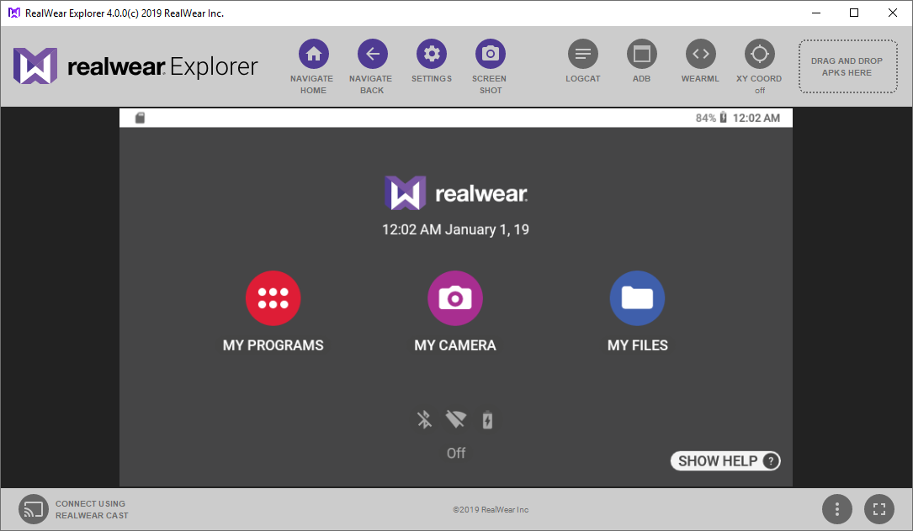
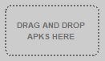
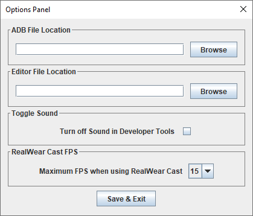

# RealWear Explorer

:::caution RealWear Explorer is deprecated

As of October 18th 2023, RealWear Explorer is now deprecated. The software will continue to operate but will no longer be receiving any updates.

If you want to share your RealWear screen, we recommend switching to [Vysor](https://www.vysor.io).

This page is no longer maintained.

:::

### Contents

This article contains the following sections:

- [Getting Started](#getting-started)
- [Connect RealWear Device to a Computer](#connect-hmt-device-to-computer)
- [Launch RealWear Explorer](#launch-realwear-explorer)
- [Additional Features](#additional-features)
- [Drag and Drop APK Files](#drag-and-drop-to-install-apks)
- [RealWear Cast](#realwear-cast)
- [RealWear Explorer Configuration Options](#realwear-explorer-configuration-options)
- [Presentation Mode](#presentation-mode)
- [Troubleshooting](#troubleshooting)

## Introduction

RealWear Explorer is a tool that mirrors the screen of your RealWear Device to your Windows or Mac computer. RealWear Explorer is compatible with all currently released RealWear Devices and allows you to view your device applications on your desktop, install new apps on your device, and enables you to use the computer mouse and keyboard to drive the device interface on these products from your computer.

RealWear Explorer offers a host of essential tools to make developing on RealWear Device an easier experience including:

- Install APKs onto RealWear Device by drag-and-dropping from the PC or Mac
- One-click snapshots of the RealWear Device screen
- Quick access to ADB command line
- Easy access to RealWear Device Logcat files

### Getting Started

#### Windows — RealWear Explorer Installation Instructions

Requirements: Microsoft Windows 7, 8 or 10.

1. [Download Windows v4.2.3 installer](https://realwear.box.com/shared/static/qjuhzzn2hmcwo6lnl3pf5eoq68plvwtq.zip): Package contains __RWexplorer_installer_4.2.3.exe__ (Windows installer for RealWear Explorer 4.2.3 which includes support for Android 10.)
2. Extract the contents of the downloaded zip file.
3. Run the RealWear Explorer installer that is extracted. This will begin the installation wizard, displaying a welcome message.
4. Click __Next__ to move to the first settings screen.
5. Select the location of where RealWear Explorer will be installed.
6. Click __Next__ to move to the next setting screen.
7. Enter a name for RealWear Explorer’s start menu folder. This can be left as the default.
8. Click __Next__ to move to the final setting screen.
9. Select if you would like a desktop icon to be created.
10. Click __Next__ to move to the install summary page.
11. An overview of the setup is displayed. Check the chosen settings are correct.
12. Click __Install__ to begin installing RealWear Explorer.
13. After the installation is complete an install summary window will be shown.
14. To launch the RealWear Explorer application after the completion of the installation Check __Launch RWexplorer__.
15. Click __Finish__ to complete installation.

#### Mac — RealWear Explorer Installation Instructions

Requirements: MacOSX 10.8+.

1. [Download Mac v4.2.3 installer](https://realwear.box.com/shared/static/6b2ve8dv9ki7n5n3p27hkvkv0ibfhc5j.zip): Package contains __RWExplorer_4.2.3.dmg__ (Mac installer for RealWear Explorer 4.2.3 which includes support for Android 10.)
2. Extract the contents of the downloaded zip file.
3. Run the RealWear Explorer installer that is extracted.
4. Drag the RealWear Explorer application icon to the __Applications__ folder.

#### Connect RealWear Device device to computer

Using the supplied USB cable, insert one end into the RealWear Device device and the other into the computer.

*Note: A USB cable is not supplied with the RealWear Navigator 500™ .*

#### Launch RealWear Explorer

Once launched, RealWear Explorer appears in a single-window application. If the devic is set up correctly and powered on, RealWear Explorer will display the contents of the device screen.

The main part of the RealWear Explorer window is used to mirror the contents of the device screen. The screen will continuously refresh at a rate of two times per second to show faithfully what the user would see when wearing the headset.

Furthermore, clicking anywhere on the screen can be used to activate the device user interface elements – for example clicking the __My Apps__ button has the same effect as speaking “My Apps” inside the headset.

Likewise, the computer keyboard can be used to type into text fields on the RealWear Device user interface. In this way the developer can view and interact with the device application without having to continually wear the device.

#### Additional features

In addition to the central screen display there are a number of additional options designed to make the developers experience easier:

### Menu buttons

| Image | Description |
| ----- | ----------- |
|  | NAVIGATE HOME: Pressing this button with cause the device to return to its home screen. Identical to speaking the “Navigate Home” voice command. |
|  | NAVIGATE BACK: Pressing this button will cause the RealWear Device to go back one screen. Identical to speaking the “Navigate Back” voice command. |
|  | SETTINGS: This is a shortcut to launch the standard Android settings on the RealWear Device device. |
|  | SCREENSHOT: This option captures the current screen of the RealWear Device device connected to the computer. See note below. |

- Mac: Screen capture is taken and is saved to the desktop with a timestamp.
- Windows: Screen capture taken and saved into the system clipboard which can be pasted into an image editor.

#### Developer tools

There are additional tools specifically for Android application developers. These tools are represented as the following icons, bottom left of the screen.

| Image | Description |
| ----- | ----------- |
|  | The “ADB” option opens up a new command prompt window, allowing for Android adb commands to be entered and run. |
|  | The “LOGCAT” option downloads the RealWear Device system log and opens it using the system’s default text editor. To change the default text editor, navigate to the File menu, select Options and then browse to the desired text editor. |
|  | The “XY COORD” option enables and disables the overlay in the display window that shows the coordinates of each mouse click. This is useful for writing WearML scripts which rely on accurate positions for the on-screen views. |
|  | The “WEARML” option opens the WearML Editor for editing WearML scripts for the connected RealWear Device. |
|  | RECENT APPS: Pressing this button will open the recent applications menu on the device, allowing you to switch between all the open applications. |

#### Drag-and-Drop to install APKs

RealWear Explorer allows you to install APKs (Android applications) on the RealWear Device, also known as “side-loading”. To side-load an app to your RealWear Device, drag an APK file from the computer desktop onto the “drop zone” of RealWear Explorer.

- Drag-and-drop APK file from desktop onto the “drop zone”.
- RealWear Explorer will install the APK and report progress.
- On completion a message will be displayed to indicate success or failure.

#### RealWear Cast

RealWear Cast provides a faster way of mirroring the screen from your device and allows you to connect to your device wirelessly.

By default RealWear Explorer mirrors the screen using ADB over USB. When mirroring the screen in this mode there is a cap of 2 frames per second which may be too slow for some users.

RealWear Cast can work wirelessly over WiFi, or wired over USB. When connected using RealWear Cast it is possible to stream at up to 30 frames per seconds.

To use RealWear Cast over USB:

- Connect the RealWear Device to RealWear Explorer using a USB cable to begin streaming at 2 FPS.
  - If the latest RealWear Cast app is installed on your device faster streaming will begin automatically.
  - If RealWear Cast app is out of date RealWear Explorer will help you to update it. Once updated, faster streaming will start automatically.
  - If RealWear Explorer isn’t installed RealWear Explorer will help you to install it. Once installed, faster streaming will start automatically.

To use RealWear Cast over WiFi:

- Ensure that the RealWear Device and the computer are on the same subnet.
- Connect the device to RealWear Explorer using a USB cable to begin streaming over USB.
- If streaming using RealWear Cast over USB begins automatically, select the “Disconnect from RealWear Cast” button.
- Select the “Connect using RealWear Cast” button again, which will connect wirelessly rather than over usb.
- Follow the instructions on the wizard to pair your device with RealWear Explorer.
- Accept any prompts on the device to allow RealWear Explorer to capture the screen.
- RealWear Cast will begin streaming wirelessly automatically. It is now safe to disconnect the USB cable without interrupting the stream.

RealWear Explorer will also remember your paired device. When RealWear Explorer is not connected to any RealWear Device the last 5 paired devices will be listed. Select the device you would like to view and RealWear Explorer will begin streaming.

#### RealWear Explorer Configuration Options

RealWear Explorer has a limited number of configuration options that can be accessed by selecting the options button.

This will display an Options Panel, allowing the following settings to be made:

- ADB File Location: By default, RealWear Explorer ships with its own copy of the ADB executable. However, this option allows different versions of ADB to be specified.
- Editor File Location: The Editor is the system text editor used to open and read the “logcat” files from RealWear Device. This option allows the user to specify a different text editor to use.
- Toggle Sound: Enables or disables sounds in RealWear Explorer.
- RealWear Cast FPS: This allows you to choose the maximum frames per second that RealWear Cast will use when streaming. A higher value will use more processing power but will result with a smoother stream, a lower value will use less power but the steam will be jerkier.
- Never ask to install RealWear Cast: When enabled, this setting will stop RealWear Explorer from prompting to install RealWear Cast when the RealWear Device is connected to your computer.

#### Presentation Mode

Presentation Mode allows RealWear Explorer to be run in full screen. This provides a way to present RealWear Device functionality in a distraction free way.

All RealWear Explorer functions still are available when in presentation mode.

To exit presentation mode use the escape key on your keyboard.

#### Troubleshooting

##### Can’t Connect to My Device

Situation:

” I have downloaded and installed the latest version of RealWear Explorer software on my computer. My HMT-1 is plugged into my computer with a USB Cable, and Explorer is running.”

Problem:

” I am unable to connect to my HMT-1 via USB cable or RealWear Cast.”

Resolution 1:

HMT-1 USB Settings Not Configured Properly

Steps to Resolve:

1. Ensure that your device is configured properly and is connected to Wifi.
2. Ensure that you have installed the latest firmware version on your device using Wireless Update located in My Programs.
3. Connect your HMT-1 (USB-C or Micro-USB port) to your computer via USB cable with Explorer running.
4. Say: “NAVIGATE HOME”, see the Home Dashboard view.
5. Say: “MY PROGRAMS”, see My Programs view.
6. Say: “SETTINGS”, see Settings view.
7. Say: “CONNECTED DEVICES”, see Connected Devices Settings view.
8. Say: “USB”, See USB Settings view.
9. Make sure you configure the device for Data Transfer, by selecting “DATA TRANSFER” from the list of options.

##### Explorer is Connected but View is Black

Situation:

” I have downloaded and installed the latest version of RealWear Explorer software on my computer. My HMT-1 is plugged into my computer with a USB Cable, and Explorer is running.”

Problem:

” While my HMT-1 appears to be connected (pressing Navigate Home in explorer controls the HMT) the cast screen in Explorer appears black.”

##### Resolution 1

*There is a problem with the RealWear Cast App on HMT-1*

Steps to Resolve:

We always recommend that you have the latest Firmware installed, that your device is charged and rebooted.

1. Disconnect your HMT-1 from your Computer.
2. Say: “NAVIGATE HOME”, see the Home Dashboard view.
3. Say: “MY PROGRAMS”, see My Programs view.
4. Say: “SETTINGS”, see Settings view.
5. Say: “Apps and Notifications”, see Apps Settings view.
6. Navigate to the RealWear Cast app; you may need to scroll through your list of all apps.
7. When you select the RealWear Cast app – uninstall it.
8. Make sure you are not running Explorer on your computer.
9. Plug in your HMT-1 device to your computer with a USB connection.
10. Open RealWear Explorer app on your computer.
11. When it asks if you want to install RealWear Cast, select ‘No’.
12. You should now see your HMT-1 screen streaming in Explorer.
