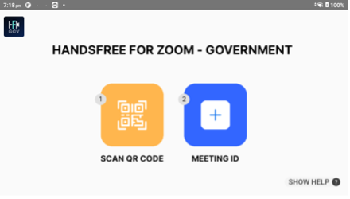

# RealWear Marketplace Submission Requirements

The [RealWear Marketplace](https://marketplace.realwear.com/) is a powerful platform for showcasing your app to millions of potential customers around the world. To ensure a positive experience for everyone involved, we have established some guidelines for app submission. Here we will go over the requirements and process for getting your app on to the [RealWear Marketplace](https://marketplace.realwear.com/).

### Requirements

- Your app should meet a certain level of quality in terms of functionality, usability, and design. We recommend thoroughly reviewing your app on at least 1 RealWear device before submitting it to ensure it meets these standards.  

- Your app should be designd to use power efficiently and be used in a way that does not risk damage to the device. Apps should not rapidly drain battery, generate excessive heat, or put unnecessary strain on device resources. 

- Your app must not contain any content that is inappropriate or offensive, such as hate speech, violence, or pornography. It should also not violate any intellectual property rights.  

- User privacy is paramount. Your app should have a clear and concise privacy policy that outlines the data it collects and how it will be used. Users should be able to control their data and have the option to opt-out of data collection.  

- Security is essential. Your app should be secure and free from any potential security risks. We recommend undergoing proper testing to identify and fix any potential vulnerabilities.  

- Ensure that your app complies with all RealWear policies and guidelines, which can be found here: https://realwear.com/legal.   

- We require that your app targets at least Android 8, API 27.  

### Submission

Once you have satisfied those guidelines, to submit your app, you must have a RealWear Pro Workspace with the Developer Toolkit enabled. Find out more about our developer program [here](https://www.realwear.com/developer/).   
  
When you have your Developer toolkit enabled in your workspace, you need to provide the following using the app submission form:
 

- 256x256px square app icon with no rounded corners  
#### Example
| Bad Example | Good Example |
| ----------- | ----------- |
|  |  |

- Up to 5 screenshots of the app running on the device.  

These must be 854x480px or 1280x720px in size, in __landscape__ orientation (the same as a user would view it on our device) and under 1mb in size.

- Ensure that your app has been tested on-device for bugs and stability before you submit it 

- Include any demo account info (and turn on your back-end service!) If your app includes a login. 

- A Ten step test plan to help our engineers verify your app. This should take our engineers through the main, or most common flow within your app so that we can verify its functionality.

- A link to any App documentation to help users

- A link to your App knowledge base

- A link to your App's privacy policy 

- A link to your App's terms of use 

- App support contact details

- A link for RealWear to download your apk. 

:::caution

If you are supplying an update to your app, you must ensure that you use the same signing key as the version already on Marketplace or else the update will be rejected.

:::