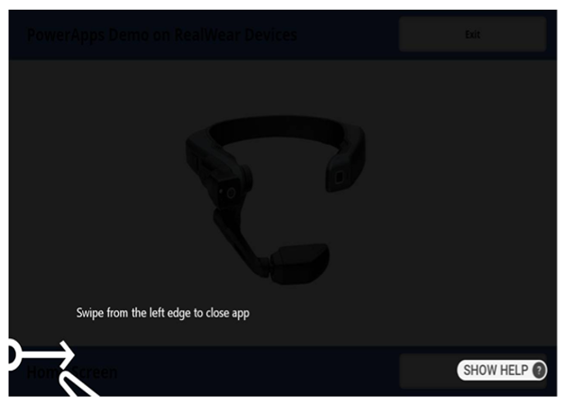
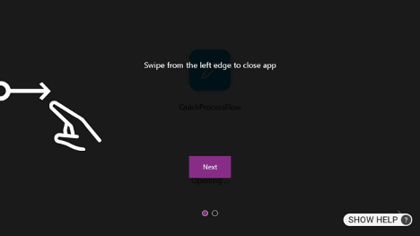
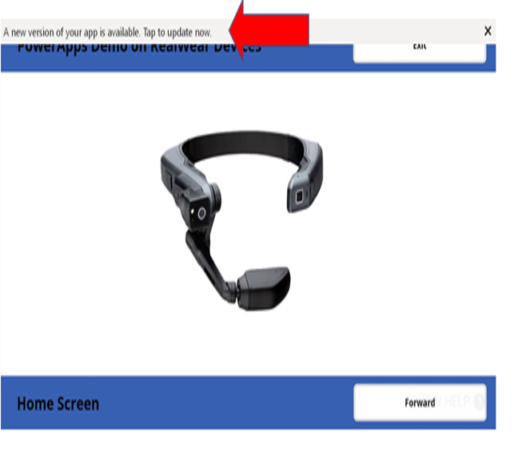
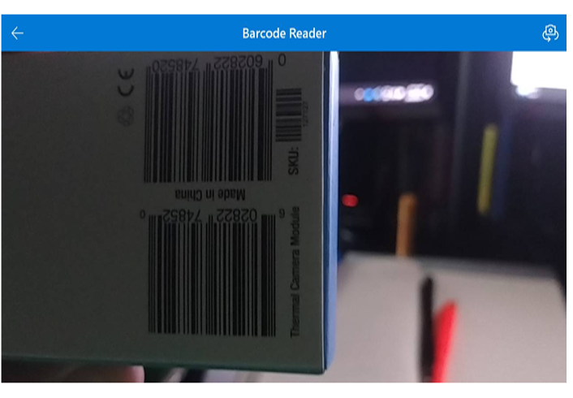
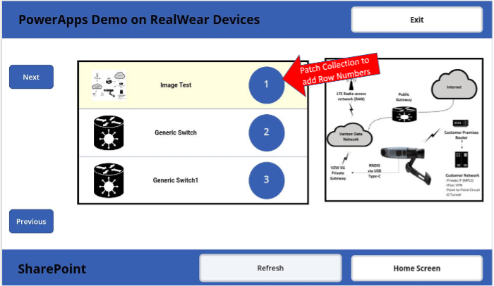

# Optimizing for RealWear

In our experience with Power Apps and RealWear headsets, we've identified a number of challenges with early developments. Below, we outline these some of the challenges when creating Power Apps for RealWear headsets and provide solutions to overcome them.

### WearML

WearML is not available inside Power Apps, we recommend you develop your app without relying on WearML bubbles.
See the UX considerations on the next page.

### Canvas Apps

When developing Power Apps for RealWear, you should always start from a 'canvas app' in Power Apps Studio. This allows for a more customized and optimized experience for RealWear headsets. The 'Model-driven app' template is not recommended for RealWear development.

### Lock Orientation to Landscape

While developing Power Apps for RealWear, you may notice that some screens display in portrait orientation, even after setting the app to landscape mode. To resolve this, an additional 'Lock Orientation' setting must be enabled in the Power Apps settings.

This setting can be found by navigating to Settings in the development environment, then to Display, and finally, selecting Lock Orientation.

It's vitally important that the setting be changed to Lock Orientation, an example of the issue without locking the orientation, can be seen below:

| Before | After |
| ----------- | ----------- |
|  |  | 

Not changing this setting can present users with a blocker as they won't be able to clear this screen as by default they won't be able to see the button to know what to say.

## Updating the app

By default, the app update banner is not voice enabled and users are not able to 'press' it in order to update their app. This can be solved by adding a WearML script to be bundled with the app in order to voice enable this control, or create a work around to force the apps to always be up to date (https://www.matthewdevaney.com/force-app-updates-in-power-apps/).

|  |
| :--: |
| * You need to ensure that this option is selected in conjunction with orientation to be set to landscape * |

### Mouse Click
During development it's useful on your RealWear headset to have the Mouse Click turned on, this enables you to move your head about using a virtual mouse on the screen, you then say 'MOUSE CLICK' to click on a button. Additionally your users may find this useful during use of the app in case there is a button that is not voice enabled.

To enable the mouse on a RealWear Headset say 'MY CONTROLS' from anywhere on the device 'MOUSE' and then 'MOUSE CLICK' to click on a button.

### Camera Access

Accessing the camera in Power Apps differs from native access. To use the RealWear Headset camera, employ the **Add Picture** control. This grants access to both the native Camera and Thermal capabilities of the headset, mirroring the functionality of the My Camera App.

:::note
Be aware that prolonged use of the Microsoft Camera Control may cause overheating in RealWear Headsets, particularly the HMT-1Z1 or Navigator-Z1 models, due to their Intrinsically Safe design.
:::

### Barcode Scanning

Although barcode scanning is a feature within MS Power Apps, not all controls are voice-enabled. The Barcode Scanner control supports voice commands, but the Barcode Reader control does not. Hence, you should use the Barcode Scanner for scanning barcodes directly rather than the Barcode Reader for reading barcodes from images.

|  |
| :---------------------------------------------------------------: |
| *The back arrow in the top bar is currently not accessible via voice commands.* |

### Scrolling

The default scroll function in Power Apps does not support voice commands, requiring users to rely on the touchpad for navigation. Alternatively, the `Scroll` control can be used to create a voice-enabled scrolling function. We recommend designing apps to fit within the screen limits to avoid excessive scrolling.

|  |
| :---------------------------------------------------: |
| *Rows are assigned numeric values for voice command navigation.* |

### Accessing non-voice-enabled controls during Development

RealWear Headsets have a feature to enable mouse click (see above) simulation via head movement and voice commands. This feature allows users to interact with non-voice-enabled controls during development. You move your head to move the point and say 'MOUSE CLICK' to click on a button, we advise having this turned on during development.

### Other Considerations

While the issues listed above are among the most common we've encountered, they are not exhaustive. Other noted challenges include:

- Certain controls, such as the 'Experimental PDF Viewer', may interfere with voice commands or affect the performance of the voice recognition engine.
