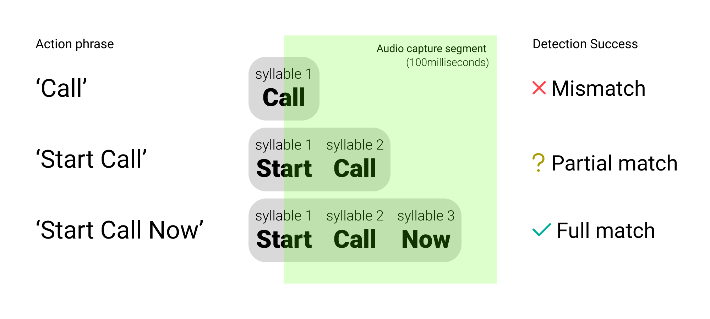
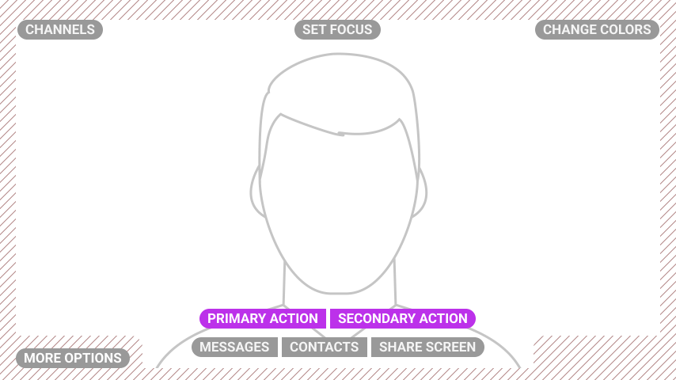

# User Experience Guidelines for Microsoft Power Apps

Welcome to our User Experience guidelines tailored for enhancing apps created with Microsoft Power Apps, especially when used on hands-free devices. These guidelines are divided into three key areas: Oral (voice interactions), Visual (user interface design), and General (best practices). By incorporating these recommendations, your Power Apps solution will deliver an optimal experience on our devices.

## General
Optimize your Power Apps for hands-free interactions by adhering to these principles:

### Recommendations:
- Identify and prioritize hands-free use cases for your Power Apps solution.
- Minimize or remove features that are cumbersome for hands-free use, such as extensive text inputs or complex settings, to improve ease of use.
- Streamline navigation and remove redundant features that do not serve hands-free users, to keep the interface uncluttered.
- Label all buttons or text inputs as WearML will be unavailable, users need to interact by saying the label.
- Ensure all buttons are voice-enabled, as users will need to interact with the app using voice commands.
- Test your app on a RealWear device to ensure it is optimized for hands-free use.

## Oral
Enhance voice interactions within your Power Apps with these guidelines:

### Use Multi-Syllable Voice Commands
For better recognition and execution on our devices, use voice commands consisting of two or more syllables. This approach minimizes errors and enhances user satisfaction.

|  |
| :--: |
| *This illustration shows how multi-syllabic commands are more effectively matched by our system.* |

## Visual
Ensure your Power Apps are visually optimized for our devices with these best practices:

### Keep Text Legible and Concise
When designing your Power Apps, keep text clear and focused. Here are some specific tips to follow:

#### Recommendations:
- Ensure text is no smaller than 16sp, ideally 20sp or larger.
- Reduce the volume of text to maintain screen clarity and legibility.
- Use uppercase for button texts to differentiate voice commands easily.

### Simplify Screen Actions
Simplify the user interface to facilitate quicker decision-making and reduce user overwhelm.

| Bad Example | Good Example |
| :-----------: | :-----------: |
|  |  |
| *Too many buttons clutter the interface, making it hard for users to navigate.* | *A streamlined interface aids in faster decision-making by reducing screen clutter.* |

### Respect Safe Areas
Design your Power Apps to keep critical visual and navigational elements within safe areas to ensure they are easily accessible.

| Bad Example | Good Example |
| :-----------: | :-----------: |
|  |  |
| *Elements at the edge can overlap with important visual information.* | *Relocating CTAs into the safe areas improves legibility and usability.* |

### Prefer Text Over Icons
In Power Apps, favor text labels over icons to prevent user confusion about what voice commands to use.

| Bad Example | Good Example |
| :-----------: | :-----------: |
|  |  |
| *Icons may lead to confusion regarding the necessary voice commands.* | *Visible text commands next to icons clarify user actions and enhance navigation.* |

### Make Interactions Obvious
Adopt a "Say What You See" approach in your Power Apps to help users quickly identify interactive elements.

| Bad Example | Good Example |
| :-----------: | :-----------: |
|  |  |
| *It's hard to tell which elements are interactive.* | *Interactive elements are highlighted to streamline navigation and user interaction.* |

### Choose Your Colour Palette Wisely
Selecting the right colors is crucial for accessibility and navigation in your Power Apps.

#### Recommendations:
- Opt for simple color palettes and sparingly use high-saturation colors.
- Avoid placing contrasting colors next to each other.
- Use gradients cautiously, especially behind text.
- Prefer dark text on light backgrounds and ensure your app looks great in both light and dark modes.

:::note

Color distinction issues on older devices may affect how colors are perceived, such as difficulties in differentiating blue from green. Always test your colors on the actual devices.

:::
