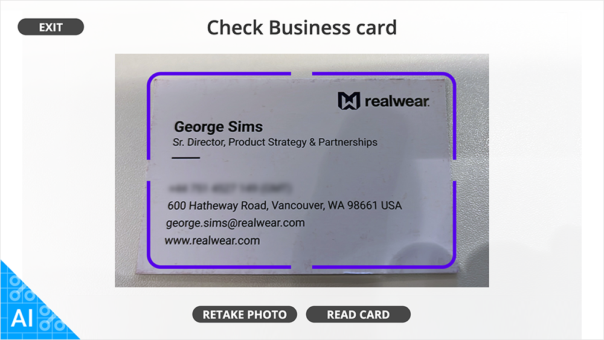
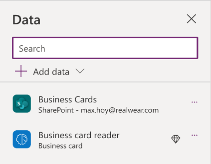
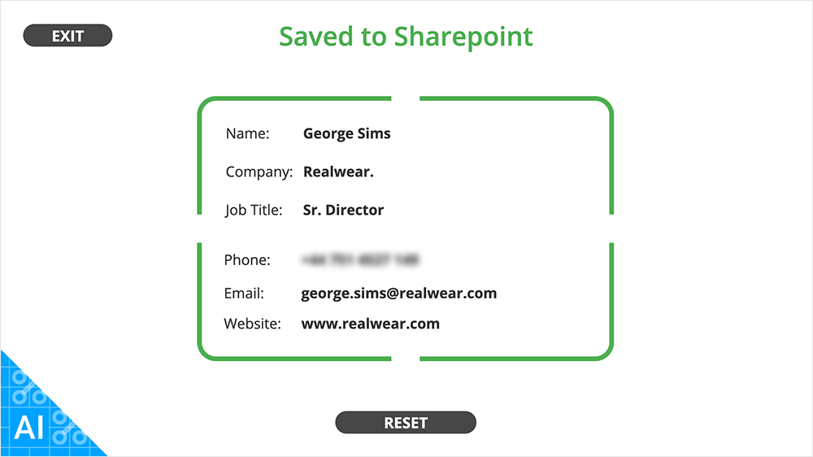

# Business Card Reader
**Microsoft Business Card AI and Sharepoint Data Capture Tutorial**

## Introduction
This tutorial accompanies the **[Power Apps Business Card Reader](../downloads/pa/RealWearBusinessCardReader_v21.zip)** demo application, created by RealWear.

It aims to give insight into how to setup your RealWear Power Apps application, use one of Microsoft’s AI models to capture data and how to easily save to Sharepoint



:::note
To create this app you will need access to Sharepoint and Power Apps, and a AI builder licence or AI demo licence
:::

## Setup Sharepoint
1. **Create your Sharepoint List**

    This is where the data we capture will be saved. All users of your app will need access to this list.
2. **Define columns** 

    This is the information you wish to extract from the business *(e.g. Business Cards - Full Name, Company, Job Title, Email, Phone, Website, Card)*. These should match the [list of key properties](https://learn.microsoft.com/en-us/ai-builder/business-card-reader-component-in-Power Apps#key-properties) Microsoft's AI can extract.
    
3. **Check Permissions**

    These are located in Settings > List Settings *(cog icon - top right of screen)*

    :::note
    
    You should check the columns names, type and required permissions in Settings. Should you need to amend the list name or it's fields later, you will need to refresh the data source in Power Apps.

    :::

## Power Apps
4. **Create a new Canvas App**

    In the Settings > Display, select *Landscape orientation*, *Scale to fit*, *Lock aspect ratio*, *Lock orientation*.
    This will ensure the app displays properly on our headset.

5. **Connect the Sharepoint list**
    1. Select the Data tab
    2. Select a data source
    Search for ‘Sharepoint’ > Sharepoint *(with your email address below)*
    3. Connect to a Sharepoint site
    4. Choose a list
    5. Connect
6. **Add the AI model**

    1. Select a data source
    2. AI Models
    3. Select Business card reader

    Here is how my data tab looks once all the sources have been added

    

7. **Define screen variables**

    For one-page apps it’s a good idea to keep the app state in a variable.
    Add `UpdateContext({Status: "ShowCamera”})` to your screens OnVisible action

8. **Create your interface**

    When creating your interface please bear in mind **[RealWear’s UI guidelines](../Basics/ux-guidelines)** around excluded areas, button and text size.
    These will help you create great Power Apps on-device experiences

9. **Create a dynamic page title**

    For one-screen apps, a dynamic page title is a great way to convey the current state of your application

    To do this, insert a Text Label and add a switch function to the Text property. This will change to reflect the various states of your app without introducing screen clutter. E.g:
    
    ```js  title="Page Title: Text Property"
    Switch(
        Status,
        "ShowCamera",
        "Scan Business card",
        "ShowImage",
        "Check Business card",
        "Checking",
        "Reading Business card..",
        "Saving",
        "Saving to Sharepoint",
        "Saved",
        "Saved to Sharepoint",
        "Failed",
        "Read Failed",
        "SPFailed",
        "Save Failed"
    )
    ```

    In its initial state the Text will show *Scan Business Card* which is the default


10. **Insert a Camera element** 

    Make sure it has a stream rate of 100


11. **Insert an Image element**

    1. Name the image element *CardImage*
    2. To show the first image captured from the Camera gallery, add `First(ImageGallery).Url` to the Image property.
    3. To automatically show the image element when a image is captured you can add `!IsBlank(First(ImageGallery))` to the Visible property.

12. **Create a ’Take Photo’ Button**

    1. Insert a button and add `ClearCollect(ImageGallery,{Url: Camera.Stream})` to the Onselect function. This will clear the Gallery named *ImageGallery* and add a new captured image to it    
    2. Update the status to “ShowImage”. E.g. `UpdateContext({Status: "ShowImage"})`
    3. If you wish to be able to retake the image, create a new button called *'Retake Photo'* and add `Clear(ImageGallery)` to it’s Onselect action. Remember to update the status too

    :::note
    
    You don’t have to add the data source *ImageGallery* as Power Apps will create it automatically

    :::

13. **Create a ‘Read Card’ button**

    This button will trigger the Business Card reader we added as a data source earlier
    
    Add the following code to the Onselect action:
    
    ```js title="Read Card Button: OnSelect Property"
    UpdateContext({Status: "Checking”});
    Set(PredictionResult, 'Business card reader'.Predict(CardImage.Image));
    IfError(
        PredictionResult;
        UpdateContext({Status: "Success"});
        If(
            IsBlank(PredictionResult.Fields.FullName) && 
            IsBlank(PredictionResult.Fields.CompanyName) &&
            IsBlank(PredictionResult.Fields.Title) && 
            IsBlank(PredictionResult.Fields.Phone1) &&
            IsBlank(PredictionResult.Fields.Email) && 
            IsBlank(PredictionResult.Fields.Website),
            UpdateContext({Status: "Failed"}),
            Select(Save_Btn)
        ),
        Notify(
            FirstError.Message,
            NotificationType.Error
        );
        UpdateContext({Status: "Failed"})
    );
    ```

    - This will fill the PredictionResult variable with the data found by the AI business card reader. We then check to make sure the reader found some of the data we wish to collect. In this case Full Name, Company Name, Job Title, Phone number, Email address, Website.
    
    - If one or more items are found we then trigger the Save Button using `Select(Save_Btn)`.

15. **Show the Results**

    When the card reader is successful, you may wish to show the result of the reader to the user.

    To do this create a group of labels for the results you wish to show e.g. Name, Company, etc. This group can be shown

    For each labels data you can add the following:

    ```js title="Label: Text"
    IfError(
        PredictionResult.Fields.FullName,
        "Couldn't read card",
        If(
            IsBlank(PredictionResult.Fields.FullName), 
            "Not found", 
            Proper(PredictionResult.Fields.FullName.Value.Text)
        )
    )
    ```

    

    - Here is the example from our demo app

15. **Create a Save button**

    When building power apps, to avoid duplicating code or having long lines of code you can create buttons which only do a part of the code and make code management easier and make testing easier. They can selected using the select() command which will trigger their OnSelect property. You can then hide these buttons from the end-user before publishing.
 
    The Save button will save your collected data to the Sharepoint list you created at the beginning. Add this code to it's Onselect property.

    ```js title="Save Button: OnSelect Property"
    UpdateContext({Status: "Saving"});
    If(
        IsEmpty(
            Errors(
                'Business Cards',
                Patch(
                    'Business Cards',
                    Defaults('Business Cards'),
                    {
                        FullName: FullName.Text,
                        Company: Company.Text,
                        'Job Title': Title.Text,
                        Phone: Phone.Text,
                        Email: Email.Text,
                        Website: Website.Text,
                        Card: CardImage.Image
                    }
                )
            )
        ),
        UpdateContext({Status: "Saved"}),
        UpdateContext({Status: "SPError"});
    )
    ```

    - We use Patch to send the data to our list and wrap it in an Errors function to catch any returned errors
    - The text from the results page is used to populate the patch data. We could also use the the PredictionResults fields directly but that would not allow for errors or blank data
    - The image data is from the image element
    - The status is then updated with the result of the patch

16. **Create an Exit button**
    
    Whilst an Exit button isn’t strictly required for the app to function, we would recommend adding to your app, especially if you wish to switch easily between different Power App applications.
    
    Add `Exit()` to it’s Onselect property

## Conclusion

You have now got the basic steps to create your own headset business card reader. Please peruse the demo application for more insight into how it was created.

**[Download the demo app files](../downloads/pa/RealWearBusinessCardReader_v21.zip)**

