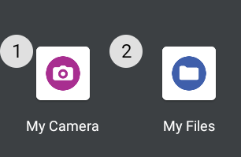

# Thermal Image Capture
**RealWear Thermal Camera, Microsoft Text Recognition AI and Sharepoint Data Capture Tutorial**

## Introduction
This tutorial accompanies the **[Power Apps Thermal Image Capture](../downloads/pa/RealWearThermalCapture_v13.zip)** demo application, created by RealWear.

It aims to give insight into how to setup your RealWear Power Apps application, use one of Microsoft’s AI models to capture text data and how to easily save to Sharepoint using a Power Flow


:::note
To create this app you will need access to Sharepoint and Power Apps, and a AI builder licence or AI demo licence
:::

## Setup Sharepoint
1. **Create your Sharepoint Library**

    This is where the data we capture will be saved. All users of your app will need access to this list.
2. **Define columns** 

    This is the information you wish to save to Sharepoint *(e.g. Image, Image Name, Temperature)*.

    
    
3. **Check Permissions**

    These are located in Settings > List Settings *(cog icon - top right of screen)*

    :::note
    
    You should check the columns names, type and required permissions in Settings. Should you need to amend the list name or it's fields later, you will need to refresh the data source in Power Apps.

    :::

## Power Apps
4. **Create a new Canvas App**

    In the Settings > Display, select *Landscape orientation*, *Scale to fit*, *Lock aspect ratio*, *Lock orientation*.
    This will ensure the app displays properly on our headset.

5. **Connect the Sharepoint list**
    1. Select the Data tab
    2. Select a data source
    Search for ‘Sharepoint’ > Sharepoint *(with your email address below)*
    3. Connect to a Sharepoint site
    4. Choose a list
    5. Connect
6. **Add the AI model**

    1. Select a data source
    2. AI Models
    3. Select Text Recognition

    Here is how my data tab looks once all the sources have been added

    

7. **Setup the Saving Flow**

    Power Apps doesn’t allow the saving of image files directly to Sharepoint so we need to create a Power Automate flow 

    1. Click on Power Automate
    2. Add Flow 
    1. Name the flow *SaveInsight*
    1. Insert a Power Apps step *(Respond to a Power Apps trigger or flow)*
    1. Insert a *Compose step > Expression > base64toBinary*
        1. Switch to the Dynamic content tab, add brackets () to base64toBinary
        1. Select *Power Apps > Createfile_FileContent*
        1. You should end up with a Compose box with an input: `base64ToBinary(triggerBody()['Createfile_FileContent'])`
    1. Insert a Create File step
        1. Site address should match the location of your sharepoint site
        1. Folder Path is where you want to save your image into.
        1. FileName uses *Dynamic content > Power Apps > Createfile_FileName*
        1. File Content uses *Dynamic Content > Compose > Outputs*
    1. Update file properties
        1. This allows us to add useful information to the image file, like it's temperature
        1. Site address should match the location of your sharepoint site
        1. Select your Library Name from the dropdown
        1. Id uses *Dynamic content > Create File > ItemId*
        1. Temperature uses *Dynamic content > Power Apps > Updatefileproperties_Temperature*

    Here is how the flow should appear:
    

7. **Define screen variables**

    For one-page apps it’s a good idea to keep the app state in a variable.
    Add the following to your screens' OnVisible action

    ```js  title="Screen: OnVisible Property"
        // App Status
        UpdateContext({
            CaptureStatus: "Start", 
            SaveStatus: "", 
            VarTemp: Blank()
        });

        // Variables
        Set(
            IID,
            "THERMAL-" & Text(
                Now(),
                "[$-en-US]mmddyyyy hhmmss"
            )
        );
    ```

    - Capture Status is set to *Start*. This is updated as we change the state of the app
    - SaveStatus captures the state of saving to Sharepoint
    - The global variable sets the name of the file to be saved

8. **Create your interface**

    When creating your interface please bear in mind **[RealWear’s UI guidelines](../Basics/ux-guidelines)** around excluded areas, button and text size.
    These will help you create great Power Apps on-device experiences

9. **Create a dynamic page title**

    For one-screen apps, a dynamic page title is a great way to convey the current state of your application

    To do this, insert a Text Label and add a switch function to the Text property. This will change to reflect the various states of your app without introducing screen clutter. E.g:
    
    ```js  title="Page Title: Text Property"
    Switch(
        CaptureStatus,
        "GetTemp",
        "Reading temperature...",
        "GotTemp",
        "Temperature found",
        "NoTemp",
        "No Temperature found",
        "Capture Thermal"
    )
    ```

    In its initial state the Text will show *Capture Thermal* which is the default

10. **Insert a AddMediaButton**

    This is how you access the thermal camera through Power Apps as the standard camera intent in Power Apps doesn’t allow access to the thermal module 
 
    :::note
    
    When used on your RealWear device the AddMediaButton will open a *Choose an action* overlay with My Camera as an option. You can then select *My Camera* and then *Thermal Camera* to see the thermal mode, and take a photo to insert a thermal image into Power Apps

    

    :::

    Add the following to the OnChange property 

    ```js  title="AddMediaButton: OnChange Property"
    If(
        !IsBlank(AddMediaButton.Media), 
        UpdateContext({CaptureStatus: "Captured"}); 
        Select(Get_Temp_btn); 
    )
    ```

    - This will update the status and start the temperature reading if media was added. We will create the Get Temp button in the next few steps

11. **Insert an Image element**

    1. Name the image element *UploadedImage*
    2. To show the image captured from the media button, add `AddMediaButton.Media` to the Image property.

13. **Create a ‘Get Temp’ button**

    This button will trigger the Text recognition we added as a data source earlier
    
    Add the following code to the Onselect action:
    
    ```js title="Get Temp Button: OnSelect Property"
    UpdateContext({CaptureStatus: "GetTemp"}); 
    Set( 
        TRR, 
        'Text recognition'.Predict(UploadedImage.Image) 
    ); 

    // Check result 
    IfError( 
        TRR; 
        UpdateContext({ 
            VarTemp: Filter( 
                First(TRR.Pages).Lines, 
                IsMatch( 
                    Text, 
                    "\b\d+(\.\d)?(?:[FfCc])\b", 
                    MatchOptions.Complete  
                ) 
                && BoundingBox.Top > 0.47  
                && BoundingBox.Top < 0.48 
                && BoundingBox.Left > 0.56 
                && BoundingBox.Left < 0.57 
            )
        }), 

        Notify( 
            FirstError.Message, 
            NotificationType.Error 
        ); 
    ); 

    If( 
        !IsEmpty(VarTemp), 
        UpdateContext({CaptureStatus: "GotTemp"}), 
        UpdateContext({CaptureStatus: "NoTemp"}) 
    ) 
    ```

    - This will fill the PredictionResult variable with the data found by the AI Text recognition.
    - As the Text Recognizer may detect other strings of text in the captured image, we are filtering for text lines only containing a temperature reading (e.g. 28.6C) by using a regex match
    - We then check to make sure the results to find a temperature line located to the right of the central crosshair

    

15. **Create a Save button**

    When building power apps, to avoid duplicating code or having long lines of code you can create Buttons which only do a part of the code and make code management easier and make testing easier. They can selected using the select() command which will trigger their OnSelect property. You can then hide these buttons from the end-user before publishing.
 
    The Save button will save your collected data to the Sharepoint library you created at the beginning. Add this code to it's Onselect property.

    ```js title="Save Button: OnSelect Property"
    ClearCollect( 
        InsightGallery, 
        {Url: UploadedImage.Image} 
    ); 

    UpdateContext({SaveStatus: "Saving"}); 

    With( 
        { 
            wJSON: With( 
                { 
                    wJSONI: JSON( 
                        UploadedImage.Image, 
                        JSONFormat.IncludeBinaryData 
                    ) 
                }, 
                Mid( 
                    wJSONI, 
                    Find( 
                        ",", 
                        wJSONI 
                    ) + 1, 
                    Len(wJSONI) - Find( 
                        ",", 
                        wJSONI 
                    ) - 1 
                ) 
            ) 
        }, 
        SaveInsight.Run( 
            image_name.Text & ".png", 
            wJSON, 
            temperature.Text
        ); 

        UpdateContext({SaveStatus: "Saved"}); 
        UpdateContext({CaptureStatus: "Finish"}); 
    ) 
    ```

    - To send the image to our Sharepoint library, we must first save it to a collection. The ClearCollect function does this and automatically creates a collection called *InsightGallery* in our data sources
    - To save an image from Power Apps to Sharepoint we first need to extract it's binary data using a JSON function
    - We're using the Power Flow to send the image name, binary data and any additional information such as temperature to our library

    

16. **Create an Exit button**
    
    Whilst an Exit button isn’t strictly required for the app to function, we would recommend adding to your app, especially if you wish to switch easily between different Power App applications.
    
    Add `Exit()` to it’s Onselect property

## Conclusion

You have now got the basic steps to create your own headset thermal camera capture app. Please peruse the demo application for more insight into how it was created.

**[Download the demo app files](../downloads/pa/RealWearThermalCapture_v13.zip)**

