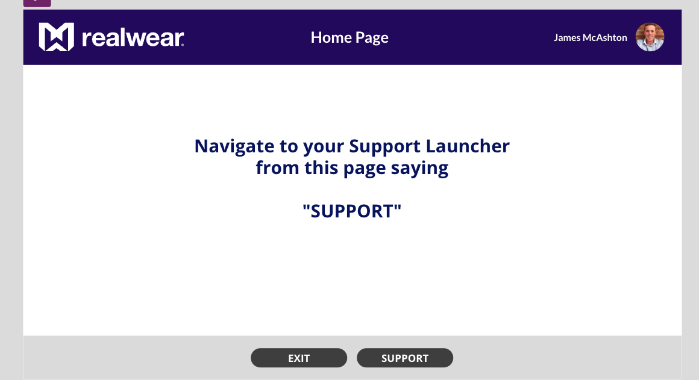
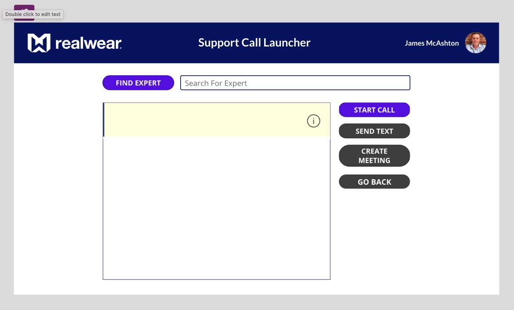
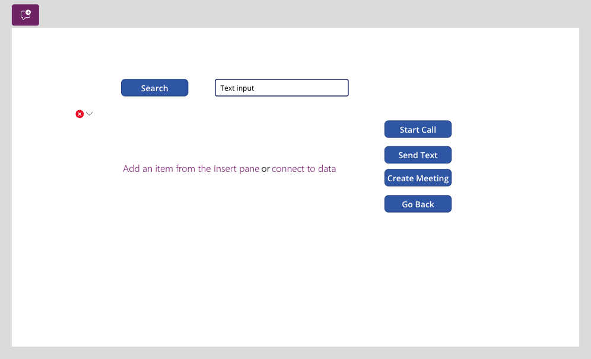
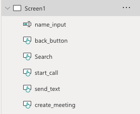
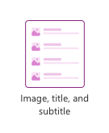
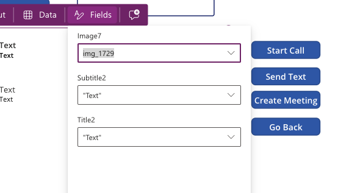
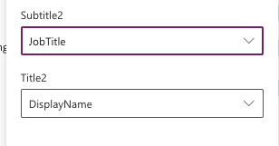
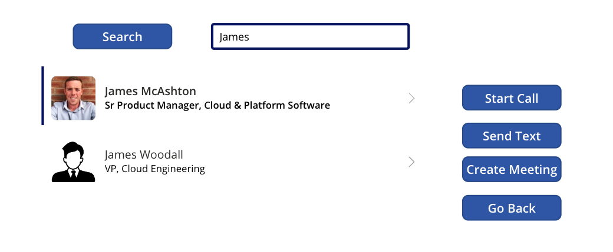

# Teams Support Call Launcher
**Microsoft Teams Call Launcher Tutorial**

## Introduction
This tutorial guides you through creating a **Teams Support Call Launcher** using MS Power Apps. The application allows users to quickly initiate support calls, send messages, and schedule meetings via Microsoft Teams.



:::note
To create this app, you will need access to Microsoft Power Apps and Office 365.
:::

## Setup Power Apps
1. **Create a Canvas App**

    In the Settings > Display, select:
    - **Landscape orientation**
    - **Scale to fit**
    - **Lock aspect ratio**
    - **Lock orientation**

    This ensures the app displays properly on a headset.



2. **Connect the Office 365 User Data**

    1. Select the Data tab.
    2. Select a data source.
    3. Search for ‘Office 365’ > Office 365 Users.
    4. Connect.



3. **Create your start page** and design it as desired.



## Configure App Startup

1. Click the **App** on the left-hand side and navigate to the `OnStart` property of the app.
2. Update it with the following formula:

    ```plaintext
    Set(gblIsHostClientWeb, Param("hostClientType")="web")
    ```

    This formula checks if the user is accessing Teams from a web browser, desktop, or mobile app.

## Create a New Canvas Screen

This will be your 'support call launcher'. Let's break down each of the elements required on this page:

- **Find Expert Button**: Focuses the window to the 'search for an expert' input box.
- **Search for an Expert Input Box**: Enables us to enter text.
- **Start Call Button**: Deeplink to MS Teams app with user context: call.
- **Send Text Button**: Deeplink to MS Teams app with user context: chat.
- **Create Meeting Button**: Deeplink to MS Teams with create meeting context: user.
- **User Details Gallery**: Displays the results of the search input box.
- **Go Back**: Returns to the home screen.

### Place Elements on the Canvas

1. Add 5 buttons, a text input, and a blank vertical gallery.
2. Link the Gallery to the Office 365 Data you imported earlier.
3. Layout the app as desired.

### Update Button Text and Names

1. Click each item and in the properties, adjust its name and text.
2. You should see your button names updated in the Tree View on the left-hand side.



### Configure the Vertical Gallery

1. In your vertical gallery, click **Layout** and choose **Image, Title, and Subtitle**.
2. Apply a filter to the gallery using the code below:

    ```plaintext
    Filter(
        Office365Users.SearchUserV2(
            {
                searchTerm: name_input.Text,
                top: 3,
                isSearchTermRequired: true
            }
        ).value,
        Not("(Archive)" in DisplayName)
    )
    ```

    This code filters the Office 365 User data based on the input from the 'name_input' text box, returning the top 3 possible matches excluding archived users.



3. Link the subheadings in the gallery to the data:
    - Update the fields to show **Display Name** for Title and **Job Title** for Subtitle.

### Link Profile Images

1. Upload a 'generic' user profile image:
    - Click the **Media** button on the left.
    - Click **Add Media** and **Upload** an image (e.g., `user_profile.png`).

2. Click the image in the gallery and add the following code:

    ```plaintext
    If(
        !IsBlank(ThisItem.Mail),
        If(
            Office365Users.UserPhotoMetadata(ThisItem.Mail).HasPhoto = true,
            Office365Users.UserPhotoV2(ThisItem.Mail),
            user_profile
        )
    )
    ```

    This code searches the Office 365 users database for profile images and displays a generic image if none are found.



## Test User Search

1. Run your app and enter a user in the text input box.
2. The gallery should update with users in your organization. If a user does not have a profile image, the uploaded generic image will be displayed.



## Create a Voice Command Button

1. Click the **Search** button and type:

    ```plaintext
    SetFocus(name_input)
    ```

    This sets the focus on the 'name_input' box, causing the RealWear headset keyboard to launch.

## Hook Up Buttons

### Teams Call

1. Click the **Start Call** button and enter the following code:

    ```plaintext
    If(
        gblIsHostClientWeb,
        Launch(
            "https://teams.microsoft.com/l/call/0/0?users=" & Gallery3.Selected.MailNickname,
            {},
            LaunchTarget.New
        ),
        Launch(
            "msteams://teams.microsoft.com/l/call/0/0?users=" & Gallery3.Selected.Mail,
            {},
            LaunchTarget.New
        )
    )
    ```

    This code checks if the app is being run on a web or mobile client and uses MS Teams deeplinks to launch a call to the selected user.

### Teams Chat

1. Use similar code for the **Send Message** button, replacing the call API with the Chat API:

    ```plaintext
    If(
        gblIsHostClientWeb,
        Launch(
            "https://teams.microsoft.com/l/chat/0/0?users=" & Gallery3.Selected.Mail & "&topicName=&message=Hi! This is a Power Apps Chat Test",
            {},
            LaunchTarget.New
        ),
        Launch(
            "msteams://teams.microsoft.com/l/chat/0/0?users=" & Gallery3.Selected.Mail & "&topicName=&message=Hi! This is a PA Chat Test",
            {},
            LaunchTarget.New
        )
    )
    ```

### Schedule Meeting

1. For the **Create Meeting** button, use the Create Meeting API:

    ```plaintext
    If(
        gblIsHostClientWeb,
        Launch(
            "https://teams.microsoft.com/l/meeting/new?subject=New%20Meeting&attendees=" & Gallery3.Selected.Mail,
            {},
            LaunchTarget.New
        ),
        Launch(
            "msteams://teams.microsoft.com/l/meeting/new?subject=New%20Meeting&attendees=" & Gallery3.Selected.Mail,
            {},
            LaunchTarget.New
        )
    )
    ```

### Go Back Button

1. For the **Go Back** button:

    ```plaintext
    Navigate(start_page)
    ```

    This simply navigates back to the home screen.

## Test Your App

1. Click the run button, search for a user, and click the start call/send text button.
2. This should cause your browser to try to launch the Teams app.

:::note
Make sure to test all functionalities thoroughly to ensure smooth operation across different devices.
:::
