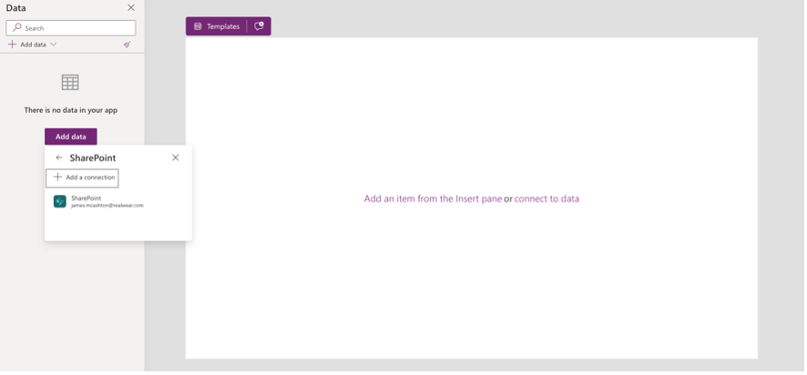
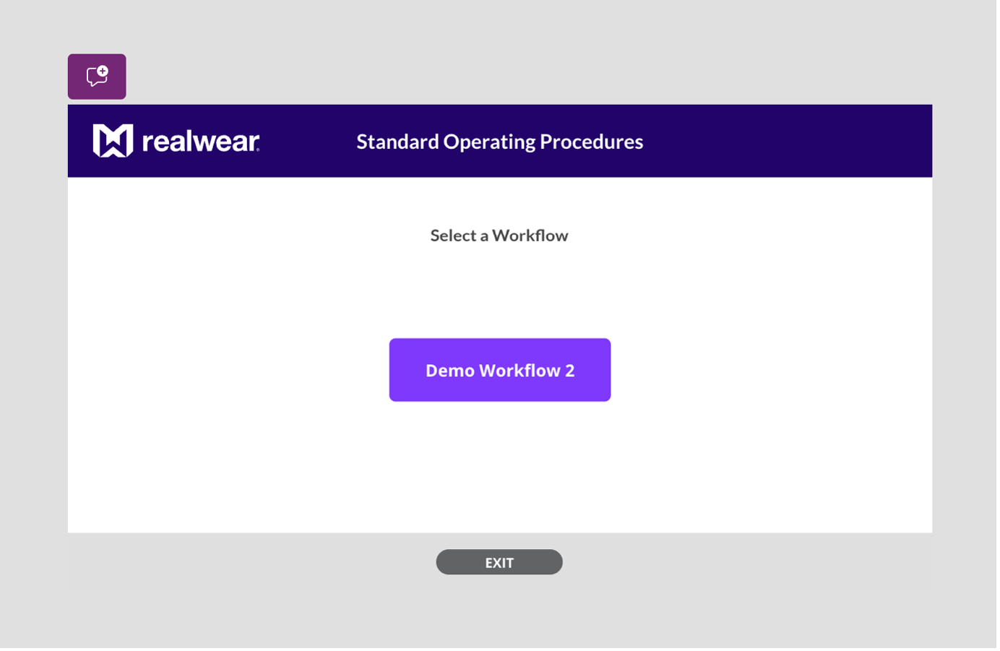
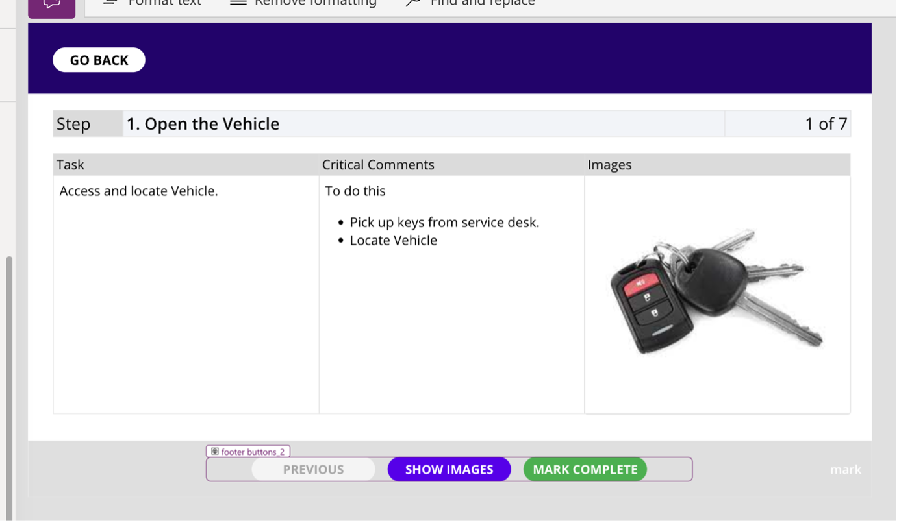
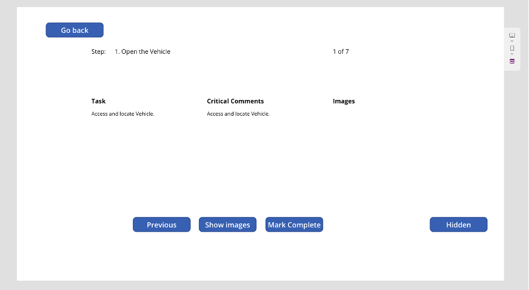
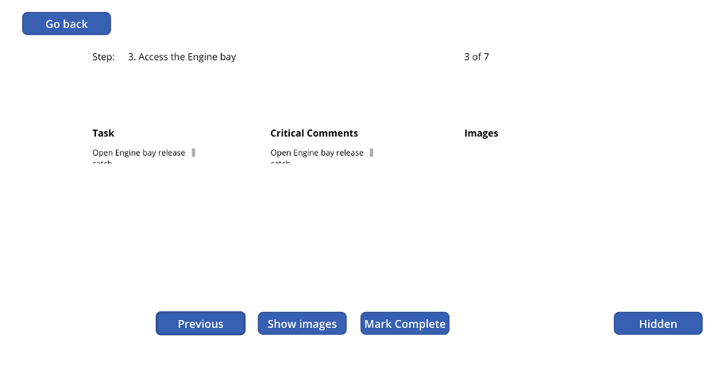
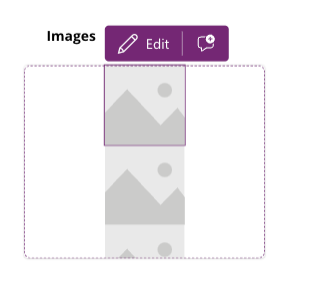
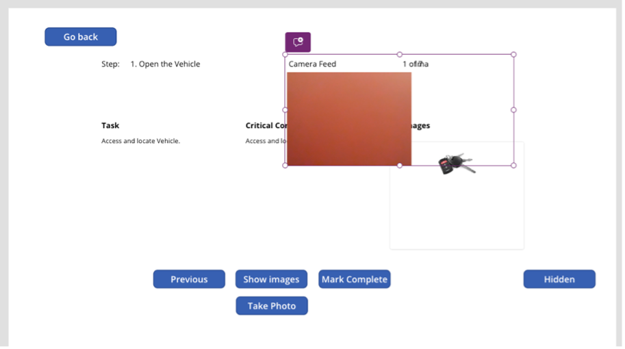
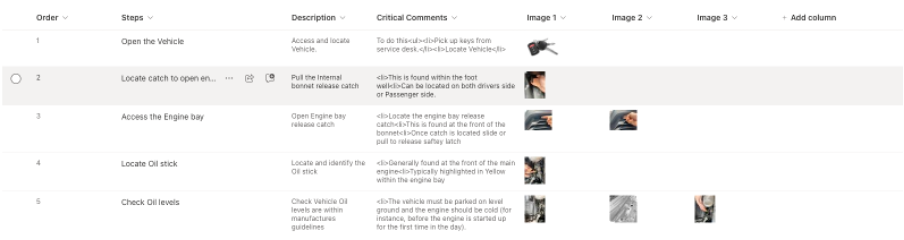
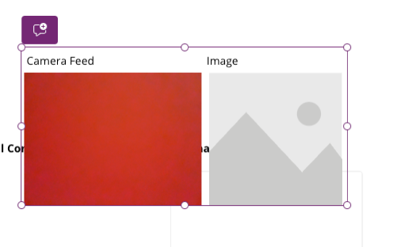
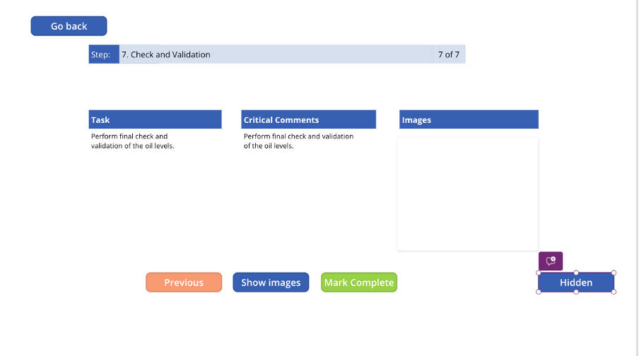

# Process Flow App
**Microsoft Process Flow App Tutorial**

## Introduction
This tutorial guides you through creating a **Process Flow App** using MS Power Apps. The application allows users to follow a predefined set of steps and capture their progress, designed specifically for use with RealWear headsets.



:::note
To create this app, you will need access to Microsoft Power Apps and SharePoint.
:::

## Setup SharePoint
1. **Create a List in SharePoint** where you will store your steps. Name this list `ProcessFlow`.

    The list should have columns for:
    - Order
    - Steps
    - Description
    - Critical Comments
    - Image 1
    - Image 2
    - Image 3

    Populate this list with 5-7 steps, order them 1-7, and add images where appropriate. This will form the basis of the steps for the end user.

2. **Create a new List in SharePoint** to store the output of the user completing the process flow. Name this list `ProcessFlow_report`.

    The list should have columns for:
    - Report_ID
    - Step_1
    - Step_2
    - Step_3
    - Step_4
    - Step_5
    - Step_6
    - Step_7
    - Image

    You do not need to populate this list, as this will happen when the user completes the process flow.

## Setup Power Apps
3. **Create a Canvas App**

    In the Settings > Display, select:
    - **Landscape orientation**
    - **Scale to fit**
    - **Lock aspect ratio**
    - **Lock orientation**

    This ensures the app displays properly on a headset.



4. **Connect to the Lists created earlier**

    1. Click the Data tab > Add data.
    2. Search for SharePoint and choose your SharePoint location.
    3. Select the two lists created earlier.



5. **Create your start page**, which is the initial page your users will see when the app loads.

    Remember to include an exit button for the user to leave the app.



## Create the Process Step Page
6. **Create a new screen** where the steps will display. You need to include:
    - Back button
    - Previous Step button
    - Show Images button
    - Mark Complete button
    - A hidden button named 'mark'
    - Labels and HTML text boxes

    Create 3 labels and name them Step_Name, Step_Lbl, Step_number. Place these near the top of the app screen.

    Create 3 additional labels for Task, Critical Comments, and Images – these will form the subheadings of the step information.

    Create 3 HTML text boxes to show HTML info from your steps.

    Your app should now look like the image below.



### Load Data into the Screen
7. **Script in the OnVisible property** of the Process Flow screen:
    - Checks for steps from the Step List.
    - Updates all variables on the screen.
    - Creates a new unique work order reference.
    - Writes that work order to the report table.

    Use this script as an example and change the list names to match your created lists:

    ```plaintext
    Refresh('ProcessFlow');
    ClearCollect(
        TableFlow,
        'ProcessFlow'
    );

    UpdateContext(
        {
            varTBLRowCount: CountRows(TableFlow),
            varIndex: 1
        }
    );

    // Create WorkOrder Variable.
    Set(
        WO,
        "WO-XXX-" & Text(
            Now(),
            "[$-en-US]mmddyyyy hhmmss"
        )
    );

    // Create report table in the new data source
    Errors(
        ProcessFlow_report,  // Updated data source
        Patch(
            ProcessFlow_report,
            Defaults(ProcessFlow_report),
            {
                Report_ID: WO
            }
        )
    )
    ```



### Hook Up Variables on the Page
8. Click the `Step_name` label you created and enter this script:

    ```plaintext
    If(
        !IsEmpty(TableFlow) && varIndex > 0 && varIndex <= varTBLRowCount,
        Index(
            TableFlow,
            varIndex
        ).Order & ". " & Index(
            TableFlow,
            varIndex
        ).Step,
        varIndex & " Capture photo"
    )
    ```

    Click the `step_number` label you created and enter this script:

    ```plaintext
    If(
        varIndex > 0 && varIndex <= varTBLRowCount,
        varIndex & " of " & varTBLRowCount,
        ""
    )
    ```

    This will show your users they are on step X of Y.

    Similarly, update the scripts for Task HTML and Critical Comments using the scripts below:

    **Task info**

    ```plaintext
    If(
        !IsEmpty(TableFlow) && varIndex > 0 && varIndex <= varTBLRowCount,
        Index(
            TableFlow,
            varIndex
        ).Description
    )
    ```

    **Critical Comments**

    ```plaintext
    If(
        !IsEmpty(TableFlow) && varIndex > 0 && varIndex <= varTBLRowCount,
        Index(
            TableFlow,
            varIndex
        ).CriticalComments
    )
    ```

<!--  -->

## Test the App
9. **Test what we have so far**

    1. Go back to the start page.
    2. Program the main button to `Navigate(screen2)` or whatever your process flow screen is called.
    3. Run your app from Screen 1.

    Click the button to start the process flow, and you should see the variables populate with the data of the first step.

<!--  -->

## Update Navigation Buttons
10. **Update the buttons to move between tasks**

    **Previous Button:**

    ```plaintext
    If(
        varIndex > 1,
        UpdateContext(
            {
                varIndex: varIndex - 1,
                varShowImages: false
            }
        )
    )
    ```

    **Mark Complete button (Next_BTN)**

    ```plaintext
    Select('Mark Btn');
    If(
        'Next BTN'.Text = "FINISH",
        Navigate(Start)
    )
    ```

    **Mark Button (relabel this button)**

    ```plaintext
    If(
        varIndex < 8,
        Patch(
            ProcessFlow_report,
            LookUp(ProcessFlow_report, Report_ID = WO),
            Switch(
                varIndex,
                1, {Step_1: "Completed"},
                2, {Step_2: "Completed"},
                3, {'Step 3': "Completed"},
                4, {'Step 4': "Completed"},
                5, {'Step 5': "Completed"},
                6, {'Step 6': "Completed"},
                7, {'Step 7': "Completed"}
            )
        );
        UpdateContext({varIndex: varIndex + 1})
    )

    // Handle the final step varIndex = 8
    // If(
    //     varIndex = 8,
    //     Patch(
    //         ProcessFlow_report,
    //         LookUp(ProcessFlow_report, Report_ID = WO),
    //         {ProofImage: First(ImageGallery).Url}
    //     )
    // )
    ```

## Finalize the App
11. **Check button functionality**

    Navigate back to Screen 1 and run the app. Click the Mark Complete and Previous buttons to move through the steps in order.



## Add Image Container
12. **Add an image container** to display images associated with the steps.

    1. Click the plus button on the left-hand nav bar.
    2. Click the Layout button and choose Vertical Container.
    3. Add three images into the container.
    4. Change the image source for each image to pull data from the Process Flow using the script below:

    ```plaintext
    If(
        !IsEmpty(TableFlow) && varIndex > 0 && varIndex <= varTBLRowCount,
        Index(
            TableFlow,
            varIndex
        ).'Image 1'.Large
    )
    ```

    These relate to the images you stored in your steps.



## Add Manual Step 8
13. **Add a manual Step 8** which prompts the user to take a photograph, stored in the report.

    1. Add 2 labels, an image gallery, and a camera view.
    2. Group these items together so they can be hidden until needed.
    3. On the camera view box, set the `cameraStream` property to 100.
    4. Add a button labeled ‘Take Photo’ and add this script to its `OnSelect` property:

    ```plaintext
    ClearCollect(ImageGallery, {Url: Camera1.Stream})
    ```

    5. To hide the camera feed and image when not required and only show when all steps are completed, use this code in the OnVisible property:

    ```plaintext
    varIndex > varTBLRowCount && !varShowImages
    ```

    This will cause the group to disappear and only appear on the last step.


## Final Testing
14. **Test the steps and camera input**

    1. Go back to Screen 1 and run your app.
    2. Click the start button and run through each step.
    3. On the last step, you should be presented with a live camera feed. Tap the ‘Take Photo’ button and see the captured image appear in the image box.

    Adjust text sizes, colors, and borders to suit your style.



### Conclusion
And that’s it! You’ve built a simple ProcessFlow app that requires the user to take a photo at the end. The data will be written into the report list you created earlier.
