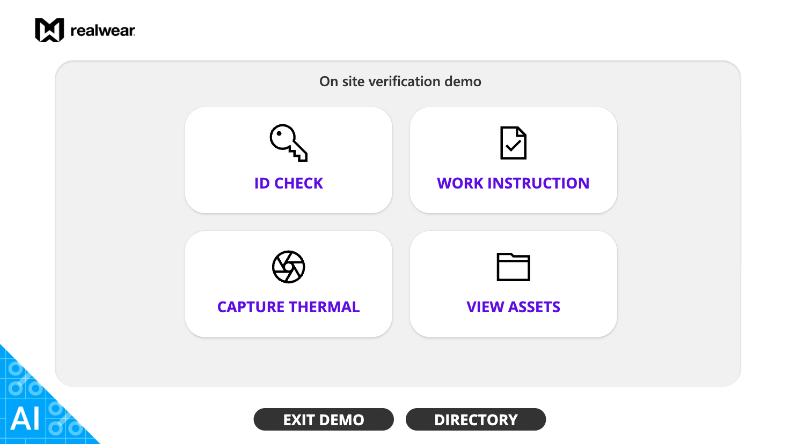
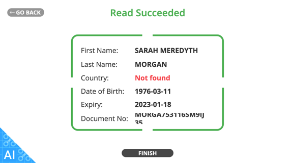
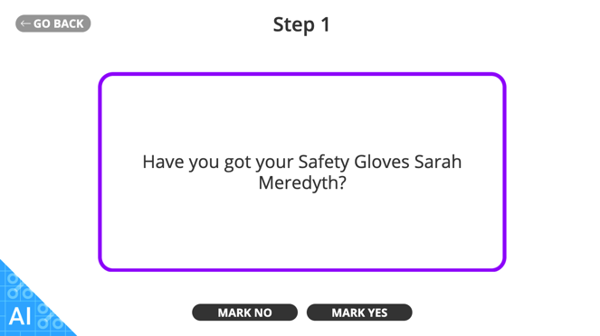
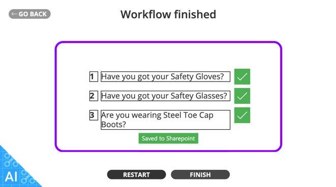
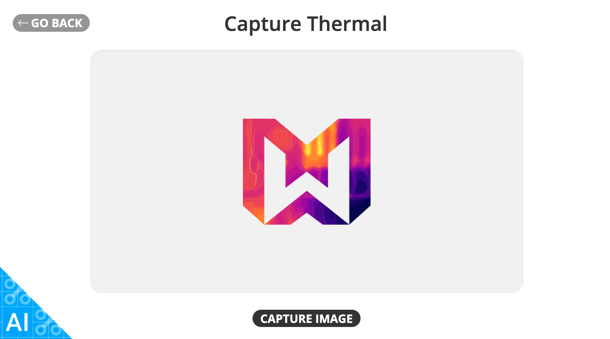
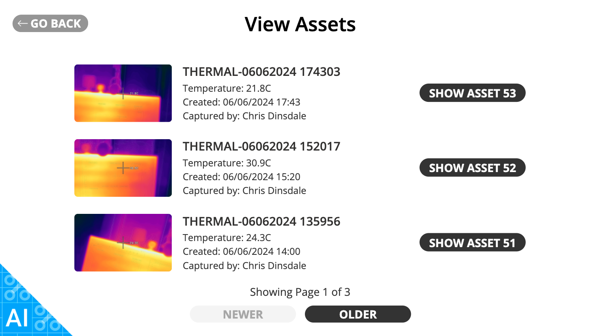

# Start Work Verification Demo

## Introduction
As an example app you can add to your environment, RealWear has created the **‘On Site Verification Demo’**.

This app has 4 main parts and uses various aspects of the Microsoft and RealWear Ecosystems:

1. **ID scanner with AI OCR recognition**
2. **Basic Work Instructions from Microsoft SharePoint**
3. **RealWear Thermal Camera imager**
4. **Asset library from SharePoint Files**

We’ll guide you through how the app works; however, as this is a more advanced type of Power App with various AI elements, we don’t explain how to build it. Remember: AI inside the Power Platform requires an additional license. Check with your Microsoft Admin.

You can access this app here: [App Link](https://rwcloudappmarketplace.blob.core.windows.net/powerapps/STARTWORKVERIFICATION_20240607100515.zip)

## ID Check
The ID Checker allows you to scan a passport, driving license, ID card, etc., and using Microsoft’s AI OCR, it will present the data back to you that it reads. See the example below.

| Scanning ID | Result |
| :-----------: | :-----------: |
|  |  |
| You can scan any type of ID card | The results returned from the AI OCT engine |

## Basic Work Instructions
Using a pre-defined list in Microsoft SharePoint Lists and the data taken from the ID check, the headset user is guided through a series of step-by-step workflow instructions. These are basic for the purpose of the demo but can definitely be edited and improved upon, including images, video, and sounds.

As you can see, using the data collected in the ID scan, the steps are personalized to the user.

## Capture Thermal
If you have a RealWear Headset with the optional Thermal Camera, using this applet will enable you to launch the thermal camera and store the image to your SharePoint.

## View Assets
Using this applet, users can view assets from a SharePoint location, such as thermal captures that have been uploaded.

