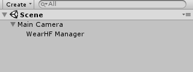
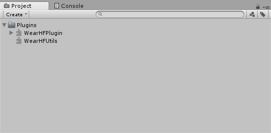
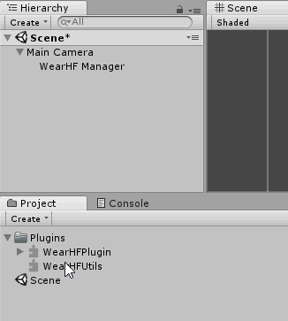

# Unity Tutorial

## Installation

To use the Unity Plugin you begin by importing 2 files into your Unity Project, WearHFPlugin.dll and WearHFUtils.aar.

It is recommended to import both files into your Assets/Plugins folder:



## Import plugin into Unity Editor



Next create an empty GameObject in your scene which will be used to load the WearHF Plugin at start up. Call it something like “WearHF Manager”:

Finally expand the WearHF Plugin in the Project View to reveal the WearHF class. This can be dragged into your “WearHF Manager” GameObject to add the WearHF Plugin as a new component:



WearHF Plugin is now ready to be used by your Unity Application.

NOTE: The plugin registers itself to the WearHF system in the GameObject’s Awake function. It is important not to use WearHF Plugin until this has taken place. To ensure this, place all your calls later in Unity’s life cycle, such as in the Start or Update functions.

## Usage

To use the plugin, grab an instance of the Game Object you created above and call the relevant function. For example to add a voice command to the system:

```cs
void Start()
{
    var wearHf = GameObject.Find("WearHF Manager").GetComponent<WearHF>();
    wearHf.AddVoiceCommand("Hello World", VoiceCommandCallback);
}

/// <summary>
/// Called when the voice command is triggered by the user
/// </summary>
/// <param name="voiceCommand">The voice command that was triggered</param>
void VoiceCommandCallback(string voiceCommand)
{
    Debug.Log("Voice command recognized: " + voiceCommand);
}
```

To see all the functionality that the plugin provides please see the [API](api-reference.md).
